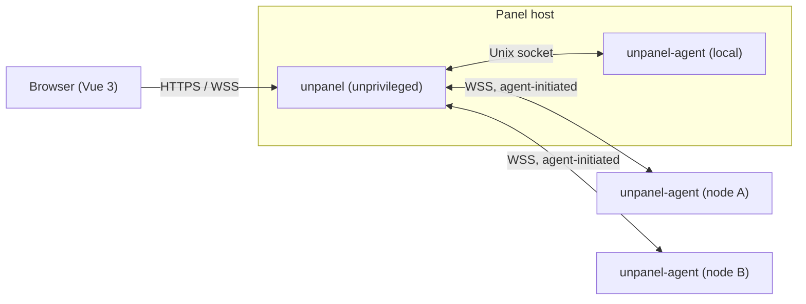

# Unpanel

**The server panel that doesn't act like one.** Simple, modern, and lightweight: one web UI for the load, alerts, containers, processes, sites, and certificates of all your servers — without turning any of them into a "panel server".

> **Status: design phase.** There is no runnable code yet. The design and knowledge base live in [`docs/`](./docs/README.md), and feedback on them is very welcome.

## Why

Most server panels are heavy: they install their own stacks, rewrite system configuration, run as root on the internet, and treat multiple servers as an afterthought. Unpanel is the opposite, hence the name:

- **Lightweight** — the agent idles under 50 MB of RAM and 0.5% of one CPU core; nothing is streamed when nobody is watching.
- **Multi-node from day one** — the local machine is just another node, so every feature works the same on 1 or 100 servers.
- **Secure by default** — HTTPS from the first visit, no default password, passkeys and TOTP, step-up authentication for dangerous actions, an unprivileged web process, and node-local policies the panel cannot override.
- **Non-invasive** — it manages what you already run, keeps its own configuration in clearly marked files, and can roll back every change it makes.
- **Pleasant to use** — a dense, dark-first dashboard inspired by [3x-ui](https://github.com/MHSanaei/3x-ui), with live charts and a signature "pulse rail" per node.

## Planned features

| Area | Highlights |
|---|---|
| Monitoring | CPU, memory, disk, network, IO, load; live (2 s) and historical charts; monthly traffic quotas; disk-full forecasts |
| Docker | Containers, images, networks, volumes, Compose stacks, logs, terminals, image update checks |
| PM2 | Per-user PM2 daemons, process control, logs |
| Nginx | Template or raw site configs, test-before-apply, automatic rollback, revision history |
| systemd | Service status and control, journal logs, watched services |
| Certificates | ACME (HTTP-01, DNS-01), ARI-based renewal, issue once and deploy to many nodes |
| Alerting | Threshold and event rules, hysteresis, silences, maintenance mode |
| Notifications | Telegram bot with commands and inline actions, webhooks |
| Access | Password + TOTP, passkeys, recovery codes, API tokens; single-user by default, switchable to team mode with node-scoped RBAC |
| Tools | Web terminal, file manager, firewall with auto-revert, managed cron, probes, backups |

See [docs/design/00-overview.md](./docs/design/00-overview.md) for priorities and milestones.

## Architecture at a glance

- **panel**: Node.js + Hono + SQLite. Serves the UI and API, authenticates users, routes requests, stores metrics, runs alerts and ACME.
- **unpanel-agent**: Node.js daemon on every server, including the panel host. All system operations happen here, through named, schema-validated RPCs. Agents connect out to the panel, so nodes expose no ports.

Details: [docs/design/01-architecture.md](./docs/design/01-architecture.md) and [docs/design/02-agent-protocol.md](./docs/design/02-agent-protocol.md).

## Documentation

- [Docs index](./docs/README.md) — reading order and conventions
- [Design](./docs/design/) — architecture, protocol, auth, security, data model, API, frontend, deployment, testing
- [Modules](./docs/modules/) — one document per feature
- [ADRs](./docs/adr/README.md) — why things are the way they are
- [Knowledge base](./docs/kb/README.md) — external-system facts, pitfalls, runbooks
- [Open questions](./docs/open-questions.md) — decisions still pending

## Supported platforms (planned)

Debian 11–13, Ubuntu 22.04/24.04, AlmaLinux/Rocky 9 (best effort); x86_64 and aarch64; systemd required. The Node.js runtime is bundled.

## Contributing

Contributions are welcome, starting with the design. Please read [CONTRIBUTING.md](./CONTRIBUTING.md) and the [Code of Conduct](./CODE_OF_CONDUCT.md).

## Security

Please do not report vulnerabilities in public issues. See [SECURITY.md](./SECURITY.md).

## License

Copyright © 2026 CodeNav Ltd and contributors. Licensed under the [GNU Affero General Public License v3.0 or later](./LICENSE).

In short:

- You may use, study, modify, and redistribute this software, including commercially.
- If you distribute a modified version, or let others use one over a network, you must release its complete source code under the same license.
- Closed-source forks and closed hosted versions are not permitted.

The project's names and logos are not covered by the license; see the [trademark policy](./TRADEMARKS.md). Contributions require signing the [CLA](./CLA.md).
