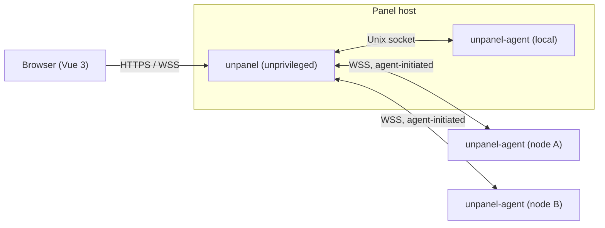

# Unpanel

**The server panel that doesn't act like one.** Simple, modern, and lightweight: one web UI for the load, alerts, containers, processes, sites, and certificates of all your servers — without turning any of them into a "panel server".

> **Status: 0.1.0-alpha.35 pre-alpha.** Alerts monitors resource thresholds, offline nodes and panel certificate expiry, with guided Telegram setup and SMTP/Resend/Postmark email notifications. First-run setup creates the owner account with a password and TOTP. Settings includes configurable sign-in restrictions and optional Cloudflare Turnstile. Updates keeps the panel ahead of its remote agents, shows every agent version, records performance diagnostics, and presents a checksummed historical release catalog with compatibility-gated downgrade choices. Automatic install stays off until it is turned on. The design and knowledge base live in [`docs/`](./docs/README.md). The public site is [`apps/site`](./apps/site).

## Install

Account security supports named TOTP, passkey and email OTP methods. Settings → Email manages shared SMTP/Resend/Postmark providers once for Alerts and OTP. Settings → Users enables team mode, scoped roles and locked read-only demo accounts. Settings → Updates provides affected-version security notices and an owner-controlled critical-update policy. See [users and permissions](./docs/kb/users-and-permissions.md), [account security](./docs/kb/account-security.md) and [security updates](./docs/kb/security-updates.md).

One command on Linux with systemd. Node.js 24 must be installed for the account that runs sudo. A copy under that account's home directory is fine; root's older system Node is ignored:

```bash
curl -fsSL https://unpanel.codenav.dev/install.sh | sudo bash
```

That downloads this version's release package into `/opt/unpanel`, checks its SHA-256, and starts the panel and the local agent. It uses this machine's public IP when the address on the interface is private. It then prints what to do next: allow the panel's TCP port at your server provider and, if enabled, in ufw or firewalld, then open the printed address and create the owner account. New direct-access installs use self-signed HTTPS. Compare the printed certificate fingerprint before trusting the browser warning, then use Certificates to request a trusted domain certificate or import PEM. Pass `--public-url` when the detected address is wrong.

A later release is installed from Settings → Updates, or with `sudo unpanel-manage update` (older installs use `sudo bash /opt/unpanel/scripts/update.sh`). The current install is moved to `/opt/unpanel.previous` before the new package replaces it. If the new process does not come up, that directory, the systemd units, and `panel.env` are restored. The database stays in place. After the panel is current, supported remote agents can be updated one at a time from the same screen.

Terminal management also provides service status, start/stop/restart, logs, account recovery and emergency Turnstile disable. Missing administrator privileges produce a clear `sudo` instruction. See `unpanel-manage help` and [terminal management](./docs/kb/terminal-management.md).

## Why

Most server panels are heavy: they install their own stacks, rewrite system configuration, run as root on the internet, and treat multiple servers as an afterthought. Unpanel is the opposite, hence the name:

- **Lightweight by design** — live views share sampling; background alert checks run every 15 seconds; notification drivers use native HTTP or a focused SMTP library. The [resource budgets](./docs/design/00-overview.md#5-resource-budgets-v1-targets) are targets, with Linux fleet measurements still pending.
- **Multi-node from day one** — the local machine uses the same monitoring and agent protocol as remote nodes.
- **Secure defaults** — self-signed HTTPS on new direct installs, no default password, configurable TOTP/passkey/email OTP verification, single-use recovery codes, encrypted credentials, an unprivileged web process, and signed agent handshakes. Team access uses built-in roles and node scopes; account-security and owner policy changes require reauthentication. Custom roles and general step-up authorization remain planned.
- **Recoverable operations** — panel and supported remote-agent updates check the replacement process and roll back failed updates. Certificate activation verifies the served certificate before accepting the change.
- **Docker management** — guided container creation, lifecycle/resource controls, logs, statistics, images, networks, volumes and managed Compose stacks. Standalone image updates verify the replacement and restore failed starts; missing Docker has an installation guide. See [current capabilities and remaining work](./docs/modules/docker.md#implementation-status).
- **Pleasant to use** — a dense, dark-first dashboard inspired by [3x-ui](https://github.com/MHSanaei/3x-ui), with live charts and a signature "pulse rail" per node.

## Roadmap

This table describes the broader v1 scope, including extensions to already shipped monitoring, alerts, certificates and updates. It is not a list of available controls. The module documents distinguish current behavior from planned work.

| Area | Highlights |
|---|---|
| Monitoring | CPU, memory, disk, network, IO, load; live (2 s) and historical charts; monthly traffic quotas; disk-full forecasts |
| Docker | Containers, images, networks, volumes, Compose stacks, logs, terminals, image update checks |
| PM2 | Per-user PM2 daemons, process control, logs |
| Nginx | Template or raw site configs, test-before-apply, automatic rollback, revision history |
| systemd | Service status and control, journal logs, watched services |
| Certificates | ACME (HTTP-01, DNS-01), ARI-based renewal, issue once and deploy to many nodes |
| Alerting | Threshold and event rules, hysteresis, silences, maintenance mode |
| Notifications | Telegram bot with commands and inline actions, webhooks |
| Access | Password + TOTP, passkeys, recovery codes, API tokens; single-user by default, switchable to team mode with node-scoped RBAC |
| Tools | Web terminal, file manager, firewall with auto-revert, managed cron, probes, backups |

See [docs/design/00-overview.md](./docs/design/00-overview.md) for priorities and milestones.

## Development

Requirements: Node.js 24, pnpm 10. See [CONTRIBUTING.md](./CONTRIBUTING.md).

```bash
pnpm install
pnpm lint && pnpm typecheck && pnpm test
pnpm dev    # panel, local agent, and web shell at http://127.0.0.1:5174
```

## Architecture at a glance



- **panel**: Node.js + Hono + SQLite. Serves the UI and API, authenticates users, routes requests, stores metrics, runs alerts and ACME.
- **unpanel-agent**: Node.js daemon on every server, including the panel host. All system operations happen here, through named, schema-validated RPCs. Agents connect out to the panel, so nodes expose no ports.

Details: [docs/design/01-architecture.md](./docs/design/01-architecture.md) and [docs/design/02-agent-protocol.md](./docs/design/02-agent-protocol.md).

## Documentation

- [Docs index](./docs/README.md) — reading order and conventions
- [Design](./docs/design/) — architecture, protocol, auth, security, data model, API, frontend, deployment, testing
- [Modules](./docs/modules/) — one document per feature
- [ADRs](./docs/adr/README.md) — why things are the way they are
- [Knowledge base](./docs/kb/README.md) — external-system facts, pitfalls, runbooks
- [Open questions](./docs/open-questions.md) — decisions still pending

## Platforms

Current release packages target Linux `x86_64` and `aarch64` with systemd. Install Node.js 24 before running the installer; it is not bundled yet. The planned distribution matrix is Debian 11–13, Ubuntu 22.04/24.04 and AlmaLinux/Rocky 9 (best effort). Full VM coverage of that matrix remains a release-readiness task.

## Contributing

Contributions are welcome, starting with the design. Please read [CONTRIBUTING.md](./CONTRIBUTING.md) and the [Code of Conduct](./CODE_OF_CONDUCT.md).

## Security

Please do not report vulnerabilities in public issues. See [SECURITY.md](./SECURITY.md).

## License

Copyright © 2026 CodeNav Ltd and contributors. Licensed under the [GNU Affero General Public License v3.0 or later](./LICENSE).

In short:

- You may use, study, modify, and redistribute this software, including commercially.
- If you distribute a modified version, or let others use one over a network, you must release its complete source code under the same license.
- Closed-source forks and closed hosted versions are not permitted.

The project's names and logos are not covered by the license; see the [trademark policy](./TRADEMARKS.md). Contributions require signing the [CLA](./CLA.md).
