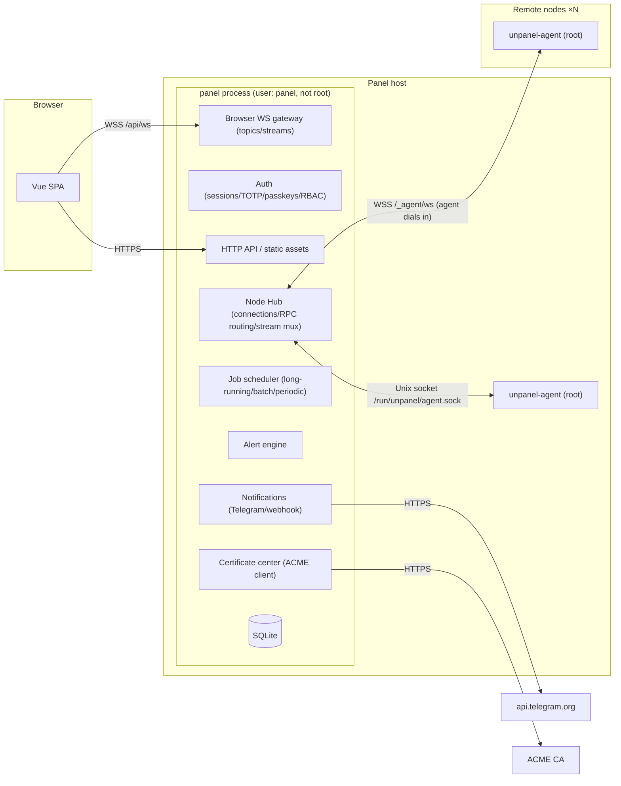
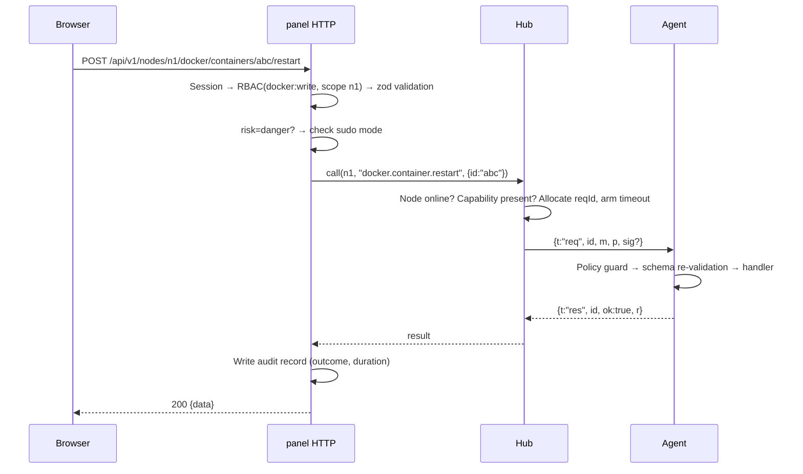
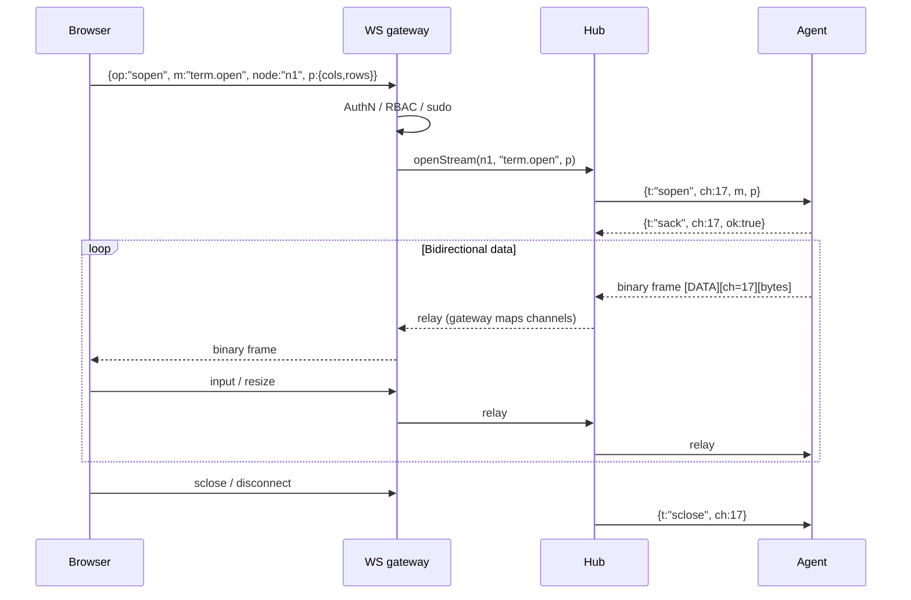

# 01 · Architecture

> Status: Draft · Related ADRs: [0001](../adr/0001-uniform-node-abstraction.md), [0002](../adr/0002-agent-initiated-connection.md), [0003](../adr/0003-unprivileged-panel-local-agent.md)

## 1. Component diagram



## 2. Responsibilities

### 2.1 Panel (`unpanel`)

| Component | Does | Does not |
|---|---|---|
| HTTP API | Routing, input validation (zod), RBAC, audit, forwarding node operations to the Hub | Touch the operating system directly |
| Auth | Login, sessions, TOTP, passkeys, recovery codes, API tokens, sudo mode | — |
| Browser WS gateway | One WebSocket per browser tab; topic subscriptions (ref-counted); stream relay (terminals, logs) | — |
| Node Hub | Agent handshake and authentication, heartbeats, request/response correlation, timeouts, stream multiplexing and backpressure, capability table | Business logic |
| Job scheduler | Queueing, progress, cancellation, and persistence of long-running work (image pulls, certificate issuance, backups, batch operations); periodic tasks (renewal checks, downsampling) | — |
| Alert engine | Consumes metrics and events, runs the rule state machines, creates incidents | Send messages |
| Notifications | Channel abstraction, templates, rate limiting, retries, Telegram bot commands | — |
| Certificate center | ACME accounts, orders, DNS providers, renewal, asking agents to deploy | Write files on nodes (agents do that) |
| Store | SQLite (WAL), Drizzle schema and migrations | — |

### 2.2 Agent (`unpanel-agent`)

| Component | Does |
|---|---|
| Transport | Connect to the panel (WSS or Unix socket), handshake, reconnect, frame codec, flow control |
| Policy guard | Load the local policy file and check every RPC before it runs (the panel cannot change this file) |
| Modules | `system`, `metrics`, `docker`, `pm2`, `nginx`, `service`, `fs`, `term`, `fw`, `cron`, `probe`, `cert`, `backup`, `agent` |
| Collector | Sample `/proc`, `/sys`, `statfs`; keep an in-memory ring buffer; compute per-minute aggregates |
| Buffer | Persist metrics and events to disk while disconnected (bounded); replay after reconnecting |
| Updater | Download, verify signatures, switch versions, roll back if health checks fail |

Modules initialize lazily. If a dependency is missing (e.g. no `docker.sock`), the module is not loaded and its capability is not reported.

## 3. Process model and privileges

| Process | User | Listens on | Notes |
|---|---|---|---|
| `unpanel` | `unpanel` (system user, no login shell) | `:<random port>` (TCP) and `/run/unpanel/agent.sock` | systemd grants `CAP_NET_BIND_SERVICE` so it can bind ports below 1024 |
| `unpanel-agent` (local) | `root` | nothing | Connects to `/run/unpanel/agent.sock` |
| `unpanel-agent` (remote) | `root` | nothing | Connects to `wss://<panel>/_agent/ws` |

Key points:

- **The local agent uses exactly the same handshake and protocol as remote agents**; only the transport differs. A single machine really is a multi-node setup with one node, with no second code path.
- Compromising the panel does not directly yield root: an attacker can only call the agent's named RPCs, and those are constrained by each node's local policy (see [design/05](./05-security.md)).
- Even the few host facts the panel needs about itself (its version, free disk space) come from the local agent.

## 4. Repository layout

A pnpm workspace monorepo, TypeScript strict mode, ESM.

```
.
├── apps/
│   ├── panel/                 Control plane
│   │   └── src/
│   │       ├── main.ts        Entry: load config → open DB → migrate → start subsystems
│   │       ├── config/        Config loading (TOML + environment overrides)
│   │       ├── db/            Drizzle schema, migrations, repositories
│   │       ├── http/          Hono app, middleware (auth/rbac/audit/csrf/ratelimit), routes
│   │       ├── auth/          Passwords, TOTP, passkeys, sessions, tokens, RBAC
│   │       ├── hub/           Agent connections, RPC client, stream mux, capability table
│   │       ├── ws/            Browser WS gateway and subscription management
│   │       ├── jobs/          Job scheduler
│   │       ├── alerts/        Rule engine
│   │       ├── notify/        Channels, Telegram bot
│   │       ├── acme/          Certificate center
│   │       ├── features/      Panel-side orchestration per feature (thin)
│   │       └── cli/           `unpanel` subcommands (admin reset, backup, doctor, ...)
│   ├── agent/
│   │   └── src/
│   │       ├── main.ts
│   │       ├── transport/
│   │       ├── policy/
│   │       ├── collector/
│   │       ├── buffer/
│   │       ├── updater/
│   │       └── modules/<name>/  Each module: detect() + handlers + events
│   └── web/
│       └── src/               See design/08
├── packages/
│   ├── protocol/              ★ The contract shared by panel, agent, and web
│   │   └── src/
│   │       ├── frames.ts      Frame types and codec
│   │       ├── errors.ts      Error codes
│   │       ├── version.ts     Protocol version
│   │       ├── capabilities.ts
│   │       └── methods/<module>.ts   zod params/result, risk level, required permission per RPC
│   └── shared/                Utilities: Result, time, IDs, logging, small crypto helpers
├── scripts/                   install.sh, build, release, dev helpers
├── tools/node-sim/            Node simulator (panel load testing)
└── docs/
```

## 5. What a feature consists of (feature slice)

Adding or changing a feature must cover all of the following; the PR template checks them as a list:

1. `packages/protocol/src/methods/<module>.ts`: method name, zod schemas, `risk` (`read` | `write` | `danger`), `permission` (e.g. `docker:write`)
2. `apps/agent/src/modules/<module>/`: `detect()` and handlers, plus events where relevant
3. `apps/panel/src/http/routes/<module>.ts`: route → RBAC → audit → `hub.call(nodeId, method, params)`
4. `apps/web/src/pages/<module>/`: pages and API calls
5. Update `docs/modules/<module>.md`; put external-system details in `docs/kb/`
6. Tests: protocol schema unit tests, agent handler tests (with fakes), panel route integration tests

Most panel routes are pass-through, so a generic `nodeRoute(method)` factory handles validation, permissions, audit, and forwarding. Only features that need orchestration (certificate distribution, batch operations, Nginx apply-and-rollback) have code in `features/`.

## 6. Request lifecycle



- **Validated on both ends**: panel and agent validate parameters with the same zod schema. The agent does not trust the panel.
- **Timeouts**: 15 s by default. Anything longer becomes a job (returns a `jobId` immediately; progress is pushed over the WebSocket).
- **Offline nodes**: the Hub returns `E_NODE_OFFLINE` immediately; nothing is queued.

## 7. Stream lifecycle (terminal, logs, image-pull progress)



Browser-side and agent-side channel numbers are allocated independently, and the gateway keeps the mapping, so a browser cannot address someone else's channel.

## 8. Source of truth

| Data | Source of truth | Other side holds |
|---|---|---|
| Users, sessions, RBAC, audit | Panel DB | — |
| Node registry, tags | Panel DB | The agent only knows its own identity |
| Runtime state (containers, processes, services, listening ports) | Node | The panel caches the latest snapshot for offline display, labeled with its capture time |
| Metric history | Panel DB | Agent ring buffer + disconnect buffer |
| Panel-managed Nginx site definitions | Panel DB (structured) | Rendered files on the node; drift detection |
| Certificates and private keys | Panel DB (encrypted) | Deployed files on nodes |
| Managed cron jobs | Panel DB | `/etc/cron.d/unpanel` on the node; drift detection |
| Firewall rules | Node | The panel keeps no copy of the rules, only the audit trail |
| Node-local policy | `/etc/unpanel-agent/policy.toml` on the node | Read-only digest reported at handshake |

**Drift detection**: for resources defined by the panel and rendered on nodes, the agent reports hashes of the rendered files. If they differ, the UI marks the resource "modified on the node" and lets the user either import the node's version or overwrite it with the panel's.

## 9. Concurrency and consistency

- **Per-node configuration locks**: on a given node, writes to Nginx, the firewall, cron, and certificate deployment are serialized in the agent (one mutex per kind), so two write → test → rollback sequences never interleave.
- **Idempotent jobs**: jobs have a `dedupeKey` (e.g. `cert.renew:<certId>`); a new job with the same key is not created while one is still pending.
- **Batch operations**: fan-out with configurable concurrency (default 5), per-node results, partial failure allowed and shown per node in the UI.

## 10. Error handling by layer

| Layer | Form |
|---|---|
| Agent handler | Throw `AgentError(code, message, details)`. Unknown exceptions are wrapped as `E_INTERNAL`; the stack trace goes to the local log, never back to the panel |
| Protocol | `{t:"res", ok:false, e:{code, msg, details?}}` |
| Panel HTTP | `{"error":{"code","message","details","requestId"}}`, with HTTP status mapped from the code (see [design/07](./07-http-api.md)) |
| Frontend | Central interceptor: `E_SUDO_REQUIRED` → step-up dialog; `E_UNAUTHENTICATED` → login; everything else → toast with expandable details |

## 11. Configuration

The panel reads `/etc/unpanel/config.toml` and the agent reads `/etc/unpanel-agent/agent.toml`; both accept `UNPANEL_*` / `UNPANEL_AGENT_*` environment overrides. Settings that can change at runtime (notification channels, alert rules) live in the `settings` table. Settings **needed at startup** or **security-sensitive** ones (listen address, data directory, master key path, trusted proxies) live only in the file. See [design/09](./09-deployment.md).

## 12. Technology choices

| Layer | Choice | ADR |
|---|---|---|
| Runtime | Node 24 LTS, bundled | [0008](../adr/0008-node-agent-language-agnostic-protocol.md) |
| HTTP | Hono + `@hono/node-server` | [0005](../adr/0005-hono.md) |
| WebSocket | `ws` | — |
| Validation | zod v4 | — |
| Database | SQLite (`better-sqlite3`, evaluating `node:sqlite`) + Drizzle | [0006](../adr/0006-sqlite-drizzle.md) |
| Logging | pino (JSON to stdout → journald) | — |
| Auth | `@simplewebauthn/server`, `@oslojs/otp`, `@node-rs/argon2` | [0004](../adr/0004-self-built-auth.md) |
| Docker | `dockerode` | — |
| Terminal | `node-pty` / xterm.js | — |
| ACME | `acme-client` | — |
| Telegram | grammY | — |
| Frontend | Vue 3 + Vite + Ant Design Vue 4 + Pinia + TanStack Query + uPlot | [0007](../adr/0007-ant-design-vue.md) |
| Build orchestration | pnpm 10 workspaces + turbo | — |
| Lint/format | TypeScript 6, ESLint (typescript-eslint, eslint-plugin-vue) + Prettier | — |
| Tests | Vitest, Playwright | — |
