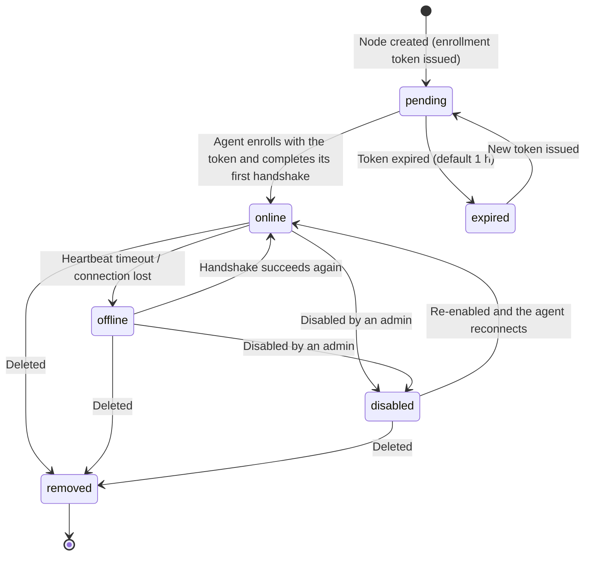
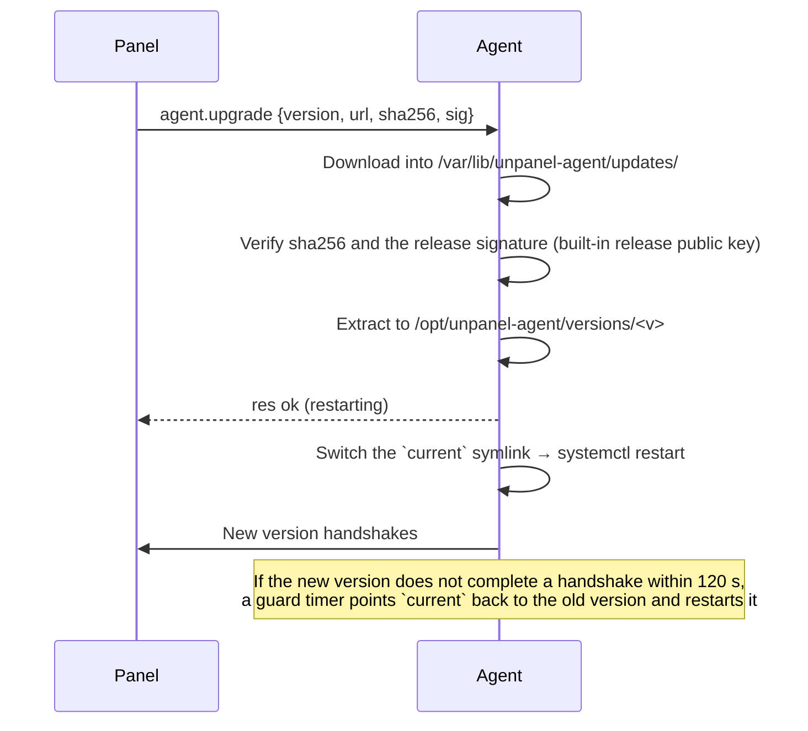

# 03 · Node Lifecycle

> Status: Draft

## 1. State machine



- `disabled`: the panel rejects the agent's handshake (4403), keeps history, and does not evaluate alerts for it.
- `removed`: the node record and public key are deleted. History is kept or deleted at the user's choice (if kept, it is archived under "deleted node" for 30 days).
- `maintenance` is not a separate state but a flag on top of online/offline: no alerts are sent while it is set.

## 2. Enrollment

### 2.1 User flow

1. An admin clicks "Add node" in the UI, enters a name and optional tags, and picks the panel address agents should use (default: the address the UI is currently served from).
2. The panel creates a **one-time enrollment token** and shows an install command:

```bash
curl -fsSL https://panel.example.com/_agent/install.sh | sudo bash -s -- \
  --panel https://panel.example.com \
  --token pe_01J9Z...   # 32 random bytes, base64url
```

3. The admin runs it on the target server. The UI shows progress live: waiting → enrolled → online.

Token properties:

- valid for 1 hour by default, single use;
- only `sha256(token)` is stored;
- bound to a pre-created `nodeId`;
- carries a fingerprint of the panel's identity public key (and, for self-signed setups, the TLS SPKI fingerprint) so the installer can refuse an impostor panel.

> Token format: `pe_<random>.<first 16 bytes of the panel public-key fingerprint, base64url>`. On first connection the agent checks that the public key in `Welcome` matches the fingerprint and aborts otherwise.

### 2.2 Enrollment protocol

Enrollment uses a dedicated, one-time HTTP endpoint; only afterwards does the WebSocket handshake begin:

```mermaid
sequenceDiagram
  participant S as install.sh / unpanel-agent enroll
  participant M as Panel
  S->>S: Download the agent package and verify its checksum
  S->>S: Generate an Ed25519 key pair (SK_a, PK_a)
  S->>M: POST /_agent/enroll {token, pkA, host, agentVer}
  M->>M: Validate the token (unexpired, unused, fingerprint matches) → mark used
  M-->>S: {agentId, panelPk, panelSpki?, wsUrl}
  S->>S: Check panelPk against the token fingerprint; write agent.toml and identity.key
  S->>S: systemctl enable --now unpanel-agent
  S->>M: WebSocket handshake (design/02 §3)
```

- `/_agent/enroll` has its own rate limit (10 requests per IP per minute), and failures are indistinguishable from each other.
- An enrolled node **cannot** have its public key replaced by a new token unless an admin first clicks "Re-enroll" in the UI (which invalidates the old key).

### 2.3 Local node

The panel installer also installs the local agent and enrolls it locally without a token (`unpanel node enroll-local`). Its `nodeId` is always `local` and its transport is the Unix socket.

## 3. Node metadata

The agent reports `HostInfo` (design/02 §3.3) on every handshake; the panel stores it in `nodes.host_info_json`. The UI shows:

- OS, kernel, architecture, virtualization type, CPU model and cores, total memory, boot time, time zone
- Public IPs: both what the agent reports locally and the source IP the panel sees (both are shown if they differ)
- Agent version, protocol version, RTT, clock skew, capabilities, policy summary

## 4. Online state

| Condition | State |
|---|---|
| An authenticated connection exists and a frame arrived within the last 45 s | `online` |
| Connection lost or timed out | `offline`, with `lastSeenAt` recorded |

Offline *alerts* have their own grace period (120 s by default) to absorb network blips; see [modules/alerting.md](../modules/alerting.md).

## 5. Behavior while a node is offline

| Operation | Behavior |
|---|---|
| Reads (lists, details) | Return the most recent cached snapshot with an `X-Snapshot-At` header; the UI shows a banner "Node offline — showing data from N minutes ago" |
| Writes | Fail immediately with `E_NODE_OFFLINE`; nothing is queued |
| Streams (terminal, logs) | Cannot be opened |
| Batch operations | Offline nodes are marked "skipped", with a one-click retry |
| Certificate deployment after renewal | The job waits in `waiting_node` and continues when the node returns. This is the only write that resumes automatically, because the system initiated it and it is idempotent |

## 6. Tags

- Tags are free-form strings (`prod`, `hk`, `db`); a node can have many.
- Tags drive overview filtering, RBAC scopes (see [design/04](./04-auth.md)), alert-rule scopes, batch-operation targets, and certificate distribution targets.
- No hierarchical groups (keep it simple).

## 7. Batch operations

- Targets: a list of nodes, a tag expression (`prod AND hk`), or all nodes.
- Implemented as one parent job plus one child job per node; default concurrency 5.
- v1 batch operations: agent upgrade, pull an image and recreate containers, restart a service, deploy a certificate, run a predefined script (P2).
- Result view: status, duration, and error per node, plus "retry failed nodes".

## 8. Agent upgrades



- Package source: the panel's cache (the panel downloads the release first) or the release server directly, depending on whether the node can reach the internet (reported as `canReachInternet`).
- The release signing public key is built into the agent. **The agent never accepts a signing key from the panel**, so even a compromised panel cannot push a malicious upgrade without also stealing the release signing key.
- The UI shows "N agents are out of date" and supports batch upgrades.

## 9. Removing a node

Shipped now: Host can disable, enable, re-enroll, and remove. Disable and remove close the socket with 4403. The agent retries once an hour. Re-enroll clears the key and returns a new one-hour command; the local node cannot be re-enrolled or removed. A removed id stays in `node_revocations`, so a later handshake is still 4403. There is no `agent.decommission` method, so the panel does not wipe the agent. Stop that process on the server.

1. Deleting in the UI sends `agent.decommission {wipe: boolean}` if the node is online.
2. The agent deletes `identity.key`, optionally cleans up managed configuration (managed Nginx files, the managed cron file, deployed certificates), then runs `systemctl disable --now unpanel-agent`.
3. The panel deletes the node's public key; any later connection from that agent is rejected with 4403.
4. If the node is offline, only step 3 happens, and the UI tells the user to run `unpanel-agent uninstall` on the server.

## 10. Clocks

- Signed requests allow ±120 s; the handshake allows ±300 s.
- Agents include their local time in `pong`; the panel computes the skew. Above 30 s it raises a "clock skew" warning and suggests checking `timedatectl` / chrony (see [kb/troubleshooting.md](../kb/troubleshooting.md)).
