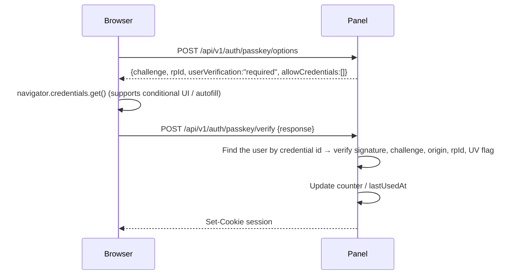

# 04 · Authentication and Authorization

> Status: Draft · Related ADRs: [0004](../adr/0004-self-built-auth.md), [0009](../adr/0009-multi-user-rbac.md), [0010](../adr/0010-https-by-default.md)
> External details: [kb/webauthn-passkey.md](../kb/webauthn-passkey.md), [kb/totp.md](../kb/totp.md)

Current implementation from alpha.25: single-user/team modes; owner, administrator, operator and viewer roles; explicit node scopes; locked read-only demo accounts; password sign-in followed by a configurable second factor (TOTP, passkey or email OTP); named method management and single-use recovery codes. Account-security and user-management changes require session-bound reauthentication for five minutes, including a factor when policy requires it. Access changes revoke affected sessions and pending logins. Email OTP and Alerts select shared named providers from Settings → Email. See [account security](../kb/account-security.md) and [users and permissions](../kb/users-and-permissions.md) for shipped routes, the role matrix and recovery behavior. Usernameless/passwordless passkeys, user-managed session lists, general sudo mode, API tokens, custom roles and tag-based role bindings remain planned. The detailed model and route catalog below include those future capabilities.

## 1. Principles

- **No auth framework.** Auth is assembled from focused low-level libraries, and every endpoint is defined by us. Nothing is exposed automatically.
- Dependencies:
  - `@simplewebauthn/server` + `@simplewebauthn/browser`: passkeys
  - `@oslojs/otp`: TOTP (RFC 6238)
  - `@oslojs/encoding`: base32 / base64url
  - `@node-rs/argon2`: password hashing (Argon2id)
  - Node `crypto`: randomness, SHA-256, AES-GCM
- All auth code lives in `apps/panel/src/auth/`. The only public routes are those listed in §9.

## 2. First-run setup (no default password)

1. The installer generates a one-time **setup token**, prints it, and writes it to `/var/lib/unpanel/setup-token` (0600):
   ```
   Panel URL: https://203.0.113.10:28517/x8Kp2Q/setup?token=st_...
   ```
2. The setup page creates the owner account (username + password). TOTP enrollment is on by default. The owner can turn it off; the page then shows a warning that the password alone can sign in. When TOTP stays on, the owner must confirm a code and that the recovery codes were saved.
3. The setup token is then deleted, and `/setup` returns 404 forever. The panel starts in single-user mode (§12.5).
4. Lost setup token: run `unpanel admin setup-token` on the server (only works while no user exists).

## 3. Users and credentials

| Credential | Per user | Notes |
|---|---|---|
| Password | 0–1 | Argon2id; passkey-only accounts have none |
| TOTP | 0–N | Named methods; secret encrypted with the master key |
| Email OTP | 0–N | Verified recipient and shared email delivery method |
| Passkeys | 0–N | Nameable ("MacBook Touch ID", "YubiKey 5") |
| Recovery codes | 10 | Single use each; stored as SHA-256 |

**Current policy** (per account, after reauthentication): require a second factor after every password sign-in and choose allowed method types. It defaults to the existing setup choice. A required policy must retain at least one verified allowed method. Enrolling a method offers to enable the requirement immediately; first enrollment also asks the user to save recovery codes. Email delivery credentials are stored in shared email methods, while an email factor stores the selected method ID and verified address.

**Future global enforcement**:

- `require2fa`, default `true`: every user must have TOTP or at least one passkey. A user with only a password is forced into enrollment after login and cannot reach anything else.
- A passkey login with user verification satisfies the 2FA requirement on its own (§5.3).

## 4. Passwords

- Argon2id with `memoryCost=19456 KiB, timeCost=2, parallelism=1` (OWASP minimum, which suits 512 MB machines). Parameters are encoded in the hash string; when they change, hashes are upgraded transparently on the next successful login.
- Length 10–128. No composition rules, but the 10,000 most common passwords (bundled list) and passwords equal to the username are rejected.
- Unknown usernames still run one verification against a fixed dummy hash so response times match; the error is always "Invalid username or password".

## 5. Login flows

### 5.1 Password + TOTP

```mermaid
sequenceDiagram
  participant B as Browser
  participant P as Panel
  B->>P: POST /api/v1/auth/login {username, password}
  P->>P: Rate-limit check → verify password
  alt No 2FA and require2fa=false
    P-->>B: Set-Cookie session; {status:"ok"}
  else Second factor required
    P->>P: Create pending_login (5 minutes; userId, available factors)
    P-->>B: {status:"mfa_required", ticket, methods:["totp","passkey","recovery"]}
    B->>P: POST /api/v1/auth/mfa/totp {ticket, code}
    P->>P: Verify TOTP (±1 step, replay protection)
    P-->>B: Set-Cookie session; {status:"ok"}
  end
```

- `ticket` is 32 random bytes; only its hash is stored. A ticket allows at most 5 second-factor attempts.
- The second step can also use a passkey (as a second factor) or a recovery code.

### 5.2 Passkey as a second factor

Current alpha.23: with a password-verified `ticket`, call `/auth/mfa/challenge` with the selected `methodId`, then submit the browser response to `/auth/mfa/verify`. `allowCredentials` contains only that account's selected credential, and user verification is required. Challenges are single-use, expire after five minutes, and match the saved public origin and exact hostname. Email uses the same challenge route to send a code; TOTP and recovery codes submit directly to verify. The legacy `/auth/mfa/totp` route remains supported.

### 5.3 Planned: usernameless passkey login



A passkey with `userVerification: "required"` is multi-factor by itself (possession of the device + biometric/PIN), so **no TOTP is asked for**.

### 5.4 Prerequisites for passkeys

The WebAuthn RP ID must be a domain, **not an IP address**, and the page must be a secure context (HTTPS or `localhost`). Browsers may also refuse WebAuthn on pages with certificate errors, so a self-signed certificate is not enough. Therefore:

- When the panel is reached by IP, or over a certificate the browser does not trust, the UI hides passkey options and shows "Passkeys become available once the panel has a domain name and a trusted certificate".
- Settings: `webauthn.rpId` (e.g. `panel.example.com` or `example.com`) and `webauthn.origins` (allowed origins).
- **Do not change the RP ID once passkeys exist**; that invalidates all of them. The UI warns and shows how many credentials would be affected.
- Details: [kb/webauthn-passkey.md](../kb/webauthn-passkey.md).

## 6. Sessions

| Property | Value |
|---|---|
| Token | 32 bytes from a CSPRNG, base64url |
| Storage | Table `sessions`; primary key `id = sha256(token)`, so a database leak does not yield usable tokens |
| Cookie | `__Host-unpanel_sid`; `HttpOnly; Secure; SameSite=Strict; Path=/` |
| Idle timeout | 12 hours (sliding; the refresh write is throttled to once per 5 minutes) |
| Absolute timeout | 7 days (30 days with "remember me") |
| Recorded | Created, last seen, IP, parsed user agent (browser/OS), login method |
| Revocation | Users can see and end any session; changing the password or resetting 2FA ends all of the user's other sessions |

Sessions are not bound to an IP (mobile IPs change often), but a change of country/ASN is recorded in the audit log (optional notification).

**Plain-HTTP exception**: when `server.tls.mode = "off"` and the panel listens only on a loopback address or Unix socket (reverse proxy or SSH tunnel), the cookie is named `unpanel_sid` without `Secure`. Any other plain-HTTP configuration refuses to start; see [ADR-0010](../adr/0010-https-by-default.md).

## 7. Sudo mode (step-up for dangerous actions)

- Sessions carry `elevatedUntil`.
- `risk: "danger"` operations (opening a terminal, deleting containers/volumes, changing the firewall, adding/removing nodes, managing users and tokens, exporting backups, viewing certificate private keys, changing security settings) require `now < elevatedUntil`; otherwise they fail with `E_SUDO_REQUIRED` (HTTP 403).
- The frontend catches that error, shows a verification dialog (passkey first, then TOTP, then password), sets `elevatedUntil = now + 10 min` on success, and replays the original request.
- `danger` operations via API tokens are allowed only if the token explicitly has `allowDanger` (§8).

## 8. API tokens

- Format: `pt_<id>_<secret>`. `id` is for lookup; `secret` is 32 bytes and stored as `sha256(secret)`.
- Properties: name, owner, a permission subset (cannot exceed the owner's permissions), node scope, optional expiry, optional IP allowlist, `allowDanger`.
- Usage: `Authorization: Bearer pt_...`. Token requests never use cookies, so CSRF does not apply.
- The plaintext is shown exactly once. Last-used time and IP are recorded (throttled to once per minute).

## 9. Auth routes (complete list)

| Method | Path | Requires |
|---|---|---|
| GET | `/api/v1/auth/state` | none (initialized?, available login methods, passkeys available?) |
| POST | `/api/v1/setup` | setup token |
| POST | `/api/v1/auth/login` | none |
| POST | `/api/v1/auth/mfa/totp` | ticket |
| POST | `/api/v1/auth/mfa/recovery` | ticket |
| POST | `/api/v1/auth/mfa/passkey/options` | ticket |
| POST | `/api/v1/auth/mfa/passkey/verify` | ticket |
| POST | `/api/v1/auth/passkey/options` | none |
| POST | `/api/v1/auth/passkey/verify` | none |
| POST | `/api/v1/auth/logout` | session |
| POST | `/api/v1/auth/sudo/options` | session (available methods and a passkey challenge) |
| POST | `/api/v1/auth/sudo` | session |
| GET | `/api/v1/me` | session |
| GET/DELETE | `/api/v1/me/sessions[/:id]` | session |
| POST | `/api/v1/me/password` | session + sudo |
| POST/DELETE | `/api/v1/me/totp` | session + sudo |
| GET/POST/PATCH/DELETE | `/api/v1/me/passkeys[/:id]` | session (registering and deleting require sudo) |
| POST | `/api/v1/me/recovery-codes` | session + sudo (regenerates; old codes are invalidated) |
| GET/POST/DELETE | `/api/v1/me/tokens[/:id]` | session + sudo |

Routes for managing other users are under `/api/v1/users` in [design/07](./07-http-api.md).

## 10. Brute-force protection

The owner can configure these controls independently in **Settings → Security**:

| Control | Default | Behavior |
|---|---|---|
| Login restrictions | On | Master switch for rate limits and password-failure lockouts |
| Per username rate limit | Progressive | The third failure waits 30 s; each later failure doubles the wait, capped at 1 h. Custom mode uses an owner-selected failure threshold and fixed wait |
| Per IP ban | 10 failures, 15 min | Blocks only the source address; the owner may choose a temporary duration or a permanent ban |
| Whole-panel lock | Off | Blocks password sign-in from every address after the configured threshold. The UI warns that a public panel can be deliberately locked |
| Cloudflare Turnstile | Off | When enabled, every password login token is validated server-side with Siteverify before password verification |
| Second factor | 5 attempts per ticket | Invalidates the pending login after the fifth failed second-factor attempt |
| TOTP replay | Always on | The last used time step is stored per user; that step and earlier ones are rejected |

- Failure counters and bans live in SQLite so restarting the service does not remove a lockout.
- From alpha.32, failed and blocked sign-in responses preserve IP and panel remaining-attempt warnings. Simultaneous cooldowns and bans are displayed together with their own retry times; an attempt rejected by an existing restriction does not increment failure counters. Expired or disabled restrictions are omitted.
- A successful password verification resets the consecutive username, address, and panel failure counters.
- Expired temporary bans are removed automatically. IP bans can also be removed from Settings.
- A whole-panel lock can be cleared from an SSH session with `sudo unpanel-manage unlock`.
- The Turnstile secret is encrypted with the panel master key. Settings responses expose only the site key and whether a secret exists.
- From alpha.22, Security opens a three-step Turnstile guide: enter the widget keys, complete a browser challenge that the panel verifies with Cloudflare, then review and save. Testing does not persist settings. Existing secrets can be retained without returning them to the browser. Keep the current session open while checking a fresh sign-in. Tokens expire after five minutes and are single-use; the test consumes its token, so sign-in needs a new challenge. Verified 2026-10-03 against [Cloudflare's Siteverify documentation](https://developers.cloudflare.com/turnstile/get-started/server-side-validation/).
- Password changes use a dialog for the current password, new password confirmation, and review. Verification happens on final save; a failed request keeps the dialog open. The caller stays signed in and other sessions and pending logins are revoked.
- The client IP is taken from `X-Forwarded-For` (rightmost untrusted address) only when the request comes from one of `server.trusted_proxies`.
- Successful/failed logins and new-device logins can trigger notifications (configurable).

## 11. Recovery

| Situation | Remedy |
|---|---|
| Lost TOTP device | Log in with a recovery code → re-enroll |
| Recovery codes lost too | On the server: `sudo unpanel admin reset-2fa <username>` (root on the server is the ultimate root of trust) |
| Forgotten password | `sudo unpanel admin reset-password <username>` |
| Forgotten panel URL/path | `sudo unpanel admin info` |
| Suspected compromise | `sudo unpanel admin lockdown`: revokes all sessions and tokens and suspends all `danger` operations on all agents until the owner logs in again and lifts it |

All `unpanel admin` actions are audited with `actor = "cli"`.

## 12. Authorization (RBAC and user modes)

### 12.1 Model

```
User ──< RoleBinding >── Role
              │
              └── scope: { kind: "all" } | { kind: "nodes", ids } | { kind: "tags", tags }
Role = set of permission strings
```

### 12.2 Built-in roles

| Role | Description |
|---|---|
| `owner` | Everything, including users, security settings, and deleting non-owner users. At least one must exist; the last owner cannot be deleted |
| `admin` | Everything except users and security settings |
| `operator` | Read plus day-to-day operations (restart containers/services, read logs, deploy certificates); no terminals, no firewall changes, no deletions |
| `viewer` | Read-only |

Custom roles are P1.

### 12.3 Permission strings

`<resource>:<action>`, where action is `read` | `write` | `danger`. `danger` implies `write`, which implies `read`.

```
node, metrics, docker, pm2, nginx, service, cert, fs, term, fw, cron, probe, backup,
alert, notify, user, token, settings, audit
```

Examples: `term:danger` allows opening terminals; `fs:write` allows uploading and editing files; `fs:danger` allows deleting files and changing permissions.

### 12.4 Checks

Every protocol method declares its `permission`, and the panel checks it centrally at the routing layer:

```ts
can(user, "docker:write", { nodeId: "n1", nodeTags: ["prod"] })
// true if any binding's role contains the permission and its scope covers the node
```

Global resources (users, settings, notification channels) can only be granted through bindings with `scope.kind = "all"`.

### 12.5 User modes

The global setting `auth.userMode` decides how much of the model above is exposed ([ADR-0009](../adr/0009-multi-user-rbac.md)).

| | `single` (default) | `team` |
|---|---|---|
| Users | Exactly one active user: the owner created at setup | Any number |
| User and role management | Hidden in the UI; `POST /users` and role routes return `E_FORBIDDEN` with `details.reason = "single_user_mode"` | Available (`user:*`) |
| RBAC check | **Runs as usual** (the owner holds `owner`, scope `all`) | Runs as usual |
| API tokens | Available, with permission subsets and node scopes | Available |
| Audit log | Records the actor as usual; the actor column is hidden in the UI | Actor column shown |

The mode only changes what is exposed. It is never consulted by `can()`, so no request is authorized differently because of it.

**Switching** (`POST /api/v1/settings/user-mode {mode}`; requires `user:danger` and sudo; audited; notifies the owner's channels):

- **single → team**: only the mode changes. The owner can then create users and bindings.
- **team → single**:
  1. The UI first fetches a preview listing every other user with their roles, active sessions, and API tokens. The owner confirms by typing the word `single`.
  2. In one transaction:
     - every user except the acting owner is set to `status = 'disabled'`, including other owners;
     - their sessions and API tokens are revoked;
     - Telegram bindings bound to them (`notification_channels.bound_user_id`) stop accepting commands;
     - role bindings are **kept**.
  3. Switching back to team mode does **not** re-enable anyone automatically; the owner re-enables users one by one.
- A disabled user cannot log in, and `unpanel admin reset-password` does not re-enable them. Re-enabling requires team mode.

Setup always starts in `single` mode. The setup page mentions that team mode can be enabled later in Settings → Users.
