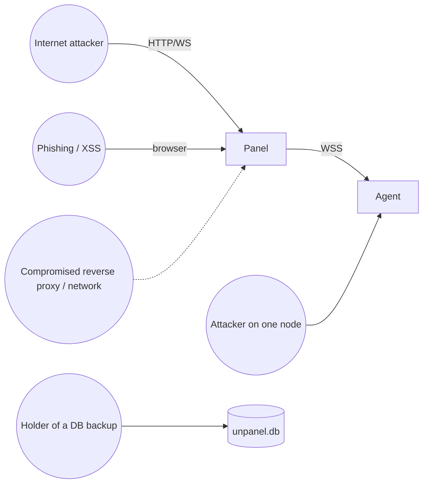

# 05 · Security

> Status: Draft · Checklist: [kb/security-checklist.md](../kb/security-checklist.md)

A server panel is, in essence, "a web entry point to root on every server". Security therefore takes priority over features and performance.

## 1. Assets

| Asset | Value |
|---|---|
| The agents' root execution capability | Highest: whoever controls it controls every node |
| Panel identity private key `SK_m` | Can impersonate the panel to all agents (still bounded by node-local policy) |
| Master key (encrypts sensitive DB fields) | Decrypts Telegram tokens, DNS API keys, certificate private keys, TOTP secrets |
| Certificate private keys | Can impersonate websites |
| User credentials and sessions | Log into the panel |
| Audit log | Post-incident investigation |

## 2. Trust boundaries and attackers



| Attacker | Goal | Main mitigations |
|---|---|---|
| Internet scanning / brute force | Log in | Random port + hidden base path + rate limits + mandatory 2FA + no default password |
| Phishing | Steal credentials | Passkeys (origin-bound, phishing-resistant); TOTP can still be phished in real time, so the UI recommends passkeys |
| XSS | Act as the user | Strict CSP, Vue's default escaping, no `v-html` for external data, logs/terminal output rendered in xterm or as plain text, `HttpOnly` cookies, sudo for dangerous actions |
| CSRF / cross-site WebSocket hijacking | Trigger actions cross-site | `SameSite=Strict`; `Origin` checked on all non-GET requests and WebSocket handshakes; JSON APIs require `Content-Type: application/json` |
| Network attacker | Read or tamper with panel ↔ agent traffic | TLS + mutual Ed25519 authentication + signed dangerous requests |
| Attacker with root on one node | Pivot to the panel and other nodes | Agents may call only a few `panel.*` methods; everything an agent reports is treated as untrusted input (escaped, length-limited, schema-validated); nodes do not trust each other |
| Panel compromise (RCE) | Control every node | Panel is not root; no generic command-execution RPC; node-local policy; agent upgrades accept only the built-in release key |
| Holder of a DB backup | Decrypt secrets | Sensitive fields are encrypted with a separate master key that is excluded from default backups (unless the user opts in and sets a backup passphrase) |
| Supply chain | Malicious dependency | Lockfile, minimal dependencies, pnpm build-script allowlist, reviewed dependency updates, signed release artifacts |

## 3. Panel hardening

### 3.1 Network exposure

- Random port (20000–60000) and random 8-character `basePath` by default; both configurable.
- Any path outside `basePath` returns a generic 404 resembling a default web-server page, without framework fingerprints (no `X-Powered-By`, no `Server` header).
- Optional: listen only on `127.0.0.1` and reach the panel over an SSH tunnel or Cloudflare Tunnel.
- Optional: IP allowlist (CIDR), with "UI restricted to the allowlist, agent endpoint unrestricted".
- `/_agent/*` endpoints are rate limited separately from the UI.

### 3.2 HTTP security headers

```
Content-Security-Policy: default-src 'self'; script-src 'self'; style-src 'self' 'nonce-<per response>';
                         img-src 'self' data: blob:; connect-src 'self'; font-src 'self';
                         frame-ancestors 'none'; base-uri 'none'; form-action 'self'; object-src 'none'
Strict-Transport-Security: max-age=31536000            (only with a publicly trusted certificate)
X-Content-Type-Options: nosniff
Referrer-Policy: no-referrer
Permissions-Policy: camera=(), microphone=(), geolocation=(), payment=()
Cross-Origin-Opener-Policy: same-origin
Cross-Origin-Resource-Policy: same-origin
```

> Ant Design Vue 4 injects `<style>` elements via CSS-in-JS, which needs a nonce or, as a fallback, `style-src 'self' 'unsafe-inline'`. Verify antdv's nonce support during M0 and record the result in [kb/ui-reference-3x-ui.md](../kb/ui-reference-3x-ui.md). Inline styles are a much smaller risk than inline scripts; `script-src` must stay strict.

### 3.3 Input and output

- All HTTP inputs, WebSocket messages, and agent-reported data are validated with zod; strings have length limits.
- The frontend never renders external strings with `v-html` (ESLint `vue/no-v-html` + review). Container names, logs, and hostnames all count as external data.
- The log viewer converts ANSI colors with a safe converter that only produces `<span class>` tokens, never arbitrary HTML.

## 4. Agent hardening

### 4.1 No generic command execution

- The protocol has **no** `exec(cmd)`-style method. The agent only calls external programs through `execFile`/`spawn` with argument arrays; **`shell: true` is forbidden**.
- User input in arguments (container IDs, unit names, paths, site names) is validated with strict patterns (e.g. unit names `^[a-zA-Z0-9:_.@-]+\.(service|socket|timer|target|path|mount)$`).
- The web terminal is the only "arbitrary command" channel. It is an explicit feature guarded three ways (the `term:danger` permission, sudo mode, node policy) and fully audited (with optional recording).

### 4.2 Node-local policy `/etc/unpanel-agent/policy.toml`

The panel **cannot** modify this file. The agent loads it at startup and on `systemctl reload unpanel-agent`. The handshake reports its SHA-256 and effective switches; the UI shows them read-only.

```toml
# Defaults (written at install time; commented-out keys use defaults)
[term]
enabled = true            # Allow the web terminal
users = ["root"]          # System users a terminal may run as

[fs]
enabled = true
write = true
deny_paths = ["/etc/unpanel-agent", "/var/lib/unpanel-agent", "/etc/shadow", "/etc/gshadow"]
# allow_paths = ["/srv", "/var/www", "/opt"]   # If set, only these prefixes are allowed

[docker]
enabled = true
allow_privileged_create = false   # Refuse privileged containers or mounts of / etc. created via the panel

[fw]
enabled = true

[cron]
enabled = true

[probe]
enabled = true
deny_cidrs = ["169.254.169.254/32", "fd00:ec2::254/128", "100.100.100.200/32"]   # Cloud metadata endpoints

[methods]
deny = []                 # Exact method names or prefixes, e.g. ["fs.delete", "docker.volume."]

[panel]
# Last line of defense if the panel is compromised: make this agent read-only
read_only = false
```

The policy guard runs after schema validation and before the handler; denials return `E_POLICY_DENIED` and are logged locally.

### 4.3 Path safety

- Every path is `path.resolve`d and then `fs.realpath`ed (following symlinks) before checking `deny_paths` / `allow_paths`, which defeats `../` and symlink tricks.
- Writes use "write temp file → fsync → rename" so a failure never leaves a half-written file.

### 4.4 The agent process

- Runs as root (required for Docker, systemd, Nginx, and the firewall). Unlike the panel it does not use most systemd sandboxing options; see [design/09](./09-deployment.md) §3.2 for the reasons.
- Listens on no port.
- Sensitive files: `identity.key` 0600 root; `agent.toml` 0600 root.

## 5. Encryption at rest

- Master key: 32 random bytes in `/etc/unpanel/master.key`, mode 0600, owned by `unpanel`, generated at install time.
- Cipher: AES-256-GCM with a fresh 12-byte random nonce per value; AAD = `<table>:<column>:<row id>`, so ciphertext cannot be copied to another row.
- Format: `v1:<keyId>:<base64url(nonce|ciphertext|tag)>`. `keyId` supports master-key rotation (`unpanel admin rotate-master-key` re-encrypts every field).
- Encrypted fields: TOTP secrets, Telegram bot tokens, DNS provider credentials, S3/WebDAV credentials, certificate private keys, ACME account keys, webhook signing secrets.
- Plaintext stays in memory as briefly as possible and is never logged (pino `redact` list).

## 6. Audit log

- Records: time, actor (user / token / CLI / system), source IP, action (method or route), target (node + resource), parameter summary (secrets redacted), outcome, duration.
- All writes and dangerous operations are recorded. Reads are recorded only when sensitive (viewing a private key, downloading a file, opening a terminal).
- **Tamper evidence**: every record includes `prevHash` and `hash = sha256(prevHash || canonicalJSON(record))`, forming a hash chain. `unpanel admin audit verify` checks the chain. Optionally, the daily chain head can be sent to Telegram/webhook as an external anchor.
- Retention: 180 days by default, configurable.

## 7. Dependencies and supply chain

- Keep runtime dependencies minimal; a PR adding one must justify it (reason, size, maintenance status).
- pnpm 10 blocks dependency build scripts by default; only explicitly approved packages (`onlyBuiltDependencies`: e.g. `better-sqlite3`, `node-pty`) may run them.
- CI runs `pnpm audit --prod`; high-severity findings block releases.
- Release artifacts are signed with minisign (Ed25519); the installer and agent upgrades verify them, see [kb/release-process.md](../kb/release-process.md).

## 8. Incident response

- `unpanel admin lockdown` (see [design/04](./04-auth.md) §11).
- On any node, `unpanel-agent policy set panel.read_only=true` takes effect immediately (it edits the local policy and reloads).
- Runbook: "Suspected panel compromise" in [kb/runbooks.md](../kb/runbooks.md).

## 9. Vulnerability disclosure

See [SECURITY.md](../../SECURITY.md) at the repository root.
