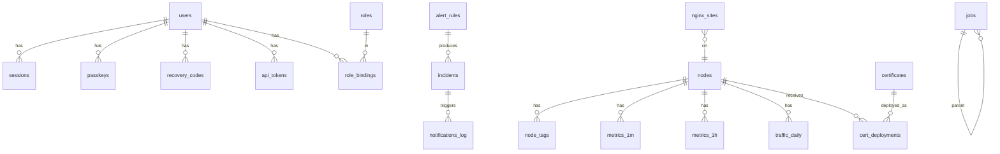

# 06 · Data Model

> Status: Draft · Related ADR: [0006](../adr/0006-sqlite-drizzle.md)

## 1. Conventions

| Item | Convention |
|---|---|
| Engine | SQLite 3, single file `/var/lib/unpanel/unpanel.db`. Driver: `better-sqlite3`, evaluating `node:sqlite` (see ADR-0006) |
| PRAGMAs | `journal_mode=WAL`, `synchronous=NORMAL`, `foreign_keys=ON`, `busy_timeout=5000`, `temp_store=MEMORY`, `auto_vacuum=INCREMENTAL` (set at creation) |
| IDs | `TEXT` UUIDv7 (time-ordered, index-friendly). Exception: the local node is `local` |
| Timestamps | `INTEGER` Unix milliseconds; column names end in `_at` |
| Booleans | `INTEGER` 0/1 |
| JSON | `TEXT`; column names end in `_json`; validated with zod on read and write |
| Encrypted | `TEXT`; column names end in `_enc`; format in [design/05](./05-security.md) §5 |
| Soft delete | Not used; data that must be retained gets an explicit archive state |
| Migrations | SQL generated by `drizzle-kit generate`, applied in order at startup. **An online backup is taken before migrating**, to `/var/lib/unpanel/backups/pre-migrate-<version>.db`. Applied migrations are never edited |

All writes happen in one process and the SQLite driver is synchronous. Bulk writes (metric ingestion, downsampling) must run inside transactions, each kept under 50 ms so the event loop is not blocked.

## 2. Overview



## 3. Users and authentication

```sql
CREATE TABLE users (
  id              TEXT PRIMARY KEY,
  username        TEXT NOT NULL UNIQUE COLLATE NOCASE,
  display_name    TEXT,
  password_hash   TEXT,                 -- argon2id string; NULL for passkey-only users
  totp_secret_enc TEXT,                 -- NULL when TOTP is not enrolled
  totp_last_step  INTEGER,              -- replay protection
  status          TEXT NOT NULL DEFAULT 'active',  -- active | disabled
  locale          TEXT, theme TEXT,
  created_at INTEGER NOT NULL, updated_at INTEGER NOT NULL, last_login_at INTEGER
);

CREATE TABLE passkeys (
  id               TEXT PRIMARY KEY,    -- credential id (base64url)
  user_id          TEXT NOT NULL REFERENCES users(id) ON DELETE CASCADE,
  webauthn_user_id TEXT NOT NULL,       -- random user handle (base64url), fixed per user
  public_key       BLOB NOT NULL,       -- COSE public key
  counter          INTEGER NOT NULL DEFAULT 0,
  transports_json  TEXT,
  device_type      TEXT,                -- singleDevice | multiDevice
  backed_up        INTEGER NOT NULL DEFAULT 0,
  name             TEXT NOT NULL,
  rp_id            TEXT NOT NULL,       -- RP ID at registration; used to warn on RP ID changes
  created_at INTEGER NOT NULL, last_used_at INTEGER
);
CREATE INDEX passkeys_user ON passkeys(user_id);

CREATE TABLE recovery_codes (
  id TEXT PRIMARY KEY, user_id TEXT NOT NULL REFERENCES users(id) ON DELETE CASCADE,
  code_hash TEXT NOT NULL, used_at INTEGER, created_at INTEGER NOT NULL
);

CREATE TABLE sessions (
  id             TEXT PRIMARY KEY,      -- sha256(token), hex
  user_id        TEXT NOT NULL REFERENCES users(id) ON DELETE CASCADE,
  auth_method    TEXT NOT NULL,         -- password+totp | passkey | password+passkey | recovery
  elevated_until INTEGER,
  ip TEXT, user_agent TEXT,
  created_at INTEGER NOT NULL, last_seen_at INTEGER NOT NULL,
  idle_expires_at INTEGER NOT NULL, absolute_expires_at INTEGER NOT NULL
);
CREATE INDEX sessions_user ON sessions(user_id);

CREATE TABLE pending_logins (           -- second-factor tickets
  id TEXT PRIMARY KEY,                  -- sha256(ticket)
  user_id TEXT NOT NULL, attempts INTEGER NOT NULL DEFAULT 0,
  webauthn_challenge TEXT, expires_at INTEGER NOT NULL
);

CREATE TABLE webauthn_challenges (       -- usernameless login / registration / sudo challenges
  id TEXT PRIMARY KEY, purpose TEXT NOT NULL, user_id TEXT, challenge TEXT NOT NULL, expires_at INTEGER NOT NULL
);

CREATE TABLE api_tokens (
  id TEXT PRIMARY KEY, user_id TEXT NOT NULL REFERENCES users(id) ON DELETE CASCADE,
  name TEXT NOT NULL, secret_hash TEXT NOT NULL,
  permissions_json TEXT NOT NULL, scope_json TEXT NOT NULL,
  allow_danger INTEGER NOT NULL DEFAULT 0, ip_allow_json TEXT,
  expires_at INTEGER, last_used_at INTEGER, last_used_ip TEXT, created_at INTEGER NOT NULL
);

CREATE TABLE roles (
  id TEXT PRIMARY KEY, name TEXT NOT NULL UNIQUE, builtin INTEGER NOT NULL DEFAULT 0,
  permissions_json TEXT NOT NULL, created_at INTEGER NOT NULL
);

CREATE TABLE role_bindings (
  id TEXT PRIMARY KEY,
  user_id TEXT NOT NULL REFERENCES users(id) ON DELETE CASCADE,
  role_id TEXT NOT NULL REFERENCES roles(id),
  scope_json TEXT NOT NULL              -- {"kind":"all"} | {"kind":"nodes","ids":[...]} | {"kind":"tags","tags":[...]}
);
```

`pending_logins` and `webauthn_challenges` are short-lived; a periodic task deletes expired rows every minute.

## 4. Nodes

```sql
CREATE TABLE nodes (
  id              TEXT PRIMARY KEY,
  name            TEXT NOT NULL UNIQUE,
  status          TEXT NOT NULL,          -- pending | active | disabled (online/offline is runtime state, not stored)
  agent_pk        TEXT,                   -- Ed25519 public key, base64url; NULL while pending
  transport       TEXT NOT NULL DEFAULT 'wss', -- wss | unix
  host_info_json  TEXT,
  caps_json       TEXT,
  policy_json     TEXT,                   -- policy digest and switches reported by the agent
  agent_version   TEXT, proto_version TEXT,
  maintenance_until INTEGER,
  traffic_json    TEXT,                   -- monthly traffic config: reset day, quota, metering mode, interfaces
  traffic_seq     INTEGER NOT NULL DEFAULT 0, -- last processed traffic.counters sequence (dedupe)
  notes           TEXT,
  sort_order      INTEGER NOT NULL DEFAULT 0,
  last_seen_at    INTEGER, last_ip TEXT,
  created_at INTEGER NOT NULL, updated_at INTEGER NOT NULL
);

CREATE TABLE node_tags (
  node_id TEXT NOT NULL REFERENCES nodes(id) ON DELETE CASCADE,
  tag TEXT NOT NULL, PRIMARY KEY (node_id, tag)
);
CREATE INDEX node_tags_tag ON node_tags(tag);

CREATE TABLE enrollment_tokens (
  id TEXT PRIMARY KEY,                    -- sha256(token)
  node_id TEXT NOT NULL REFERENCES nodes(id) ON DELETE CASCADE,
  created_by TEXT NOT NULL, expires_at INTEGER NOT NULL, used_at INTEGER
);

CREATE TABLE node_snapshots (            -- latest snapshots for offline display
  node_id TEXT NOT NULL REFERENCES nodes(id) ON DELETE CASCADE,
  kind TEXT NOT NULL,                     -- docker.containers | pm2.list | service.list | ...
  data_json TEXT NOT NULL, captured_at INTEGER NOT NULL,
  PRIMARY KEY (node_id, kind)
);
```

## 5. Monitoring

Core metrics are real columns (easy to query and downsample); variable dimensions (per mount, per interface) go into JSON.

```sql
CREATE TABLE metrics_1m (
  node_id TEXT NOT NULL, ts INTEGER NOT NULL,          -- start of the minute
  cpu_avg REAL, cpu_max REAL, iowait REAL, steal REAL,
  load1 REAL, load5 REAL, load15 REAL,
  mem_used INTEGER, mem_total INTEGER, swap_used INTEGER, swap_total INTEGER,
  disk_used_max_pct REAL,                              -- usage of the fullest mount
  disk_read_bps REAL, disk_write_bps REAL,
  net_rx_bps REAL, net_tx_bps REAL, net_rx_bps_max REAL, net_tx_bps_max REAL,
  tcp_conn INTEGER, udp_conn INTEGER, procs INTEGER,
  extra_json TEXT,                                     -- {"mounts":{...},"ifaces":{...},"temps":{...}}
  PRIMARY KEY (node_id, ts)
) WITHOUT ROWID;

CREATE TABLE metrics_1h ( /* same columns as metrics_1m */ PRIMARY KEY (node_id, ts)) WITHOUT ROWID;

CREATE TABLE traffic_daily (
  node_id TEXT NOT NULL, day TEXT NOT NULL,            -- 'YYYY-MM-DD' in the node's time zone
  iface TEXT NOT NULL,                                 -- '*' = sum of interfaces counted toward the quota
  rx INTEGER NOT NULL, tx INTEGER NOT NULL,
  PRIMARY KEY (node_id, day, iface)
) WITHOUT ROWID;
```

Retention and downsampling: [modules/monitoring.md](../modules/monitoring.md).

## 6. Alerts and notifications

```sql
CREATE TABLE alert_rules (
  id TEXT PRIMARY KEY, name TEXT NOT NULL, enabled INTEGER NOT NULL DEFAULT 1,
  kind TEXT NOT NULL,              -- metric | event | node_offline | cert_expiry | probe | traffic_quota | disk_forecast | ...
  scope_json TEXT NOT NULL,        -- which nodes
  condition_json TEXT NOT NULL,    -- depends on kind; see modules/alerting.md
  for_sec INTEGER NOT NULL DEFAULT 0,
  severity TEXT NOT NULL,          -- info | warning | critical
  channels_json TEXT NOT NULL,     -- notification channel ids
  repeat_sec INTEGER,              -- reminder interval while firing; NULL = no reminders
  notify_resolved INTEGER NOT NULL DEFAULT 1,
  builtin INTEGER NOT NULL DEFAULT 0,
  created_at INTEGER NOT NULL, updated_at INTEGER NOT NULL
);

CREATE TABLE incidents (
  id TEXT PRIMARY KEY,
  short_id INTEGER NOT NULL UNIQUE,  -- human-friendly sequence number for Telegram commands/buttons (/ack 12)
  rule_id TEXT NOT NULL REFERENCES alert_rules(id) ON DELETE CASCADE,
  dedupe_key TEXT NOT NULL,          -- rule_id + node_id + target
  node_id TEXT, target TEXT,         -- e.g. container name, mount point, domain
  state TEXT NOT NULL,               -- firing | resolved
  silenced INTEGER NOT NULL DEFAULT 0,
  severity TEXT NOT NULL, summary TEXT NOT NULL, details_json TEXT,
  started_at INTEGER NOT NULL, resolved_at INTEGER, acked_by TEXT, acked_at INTEGER,
  last_notified_at INTEGER
);
CREATE UNIQUE INDEX incidents_open ON incidents(dedupe_key) WHERE state = 'firing';
CREATE INDEX incidents_time ON incidents(started_at);

CREATE TABLE silences (
  id TEXT PRIMARY KEY, matcher_json TEXT NOT NULL,   -- {ruleId?, nodeId?, tag?, target?}
  reason TEXT, created_by TEXT NOT NULL, starts_at INTEGER NOT NULL, ends_at INTEGER NOT NULL
);

CREATE TABLE notification_channels (
  id TEXT PRIMARY KEY, name TEXT NOT NULL, kind TEXT NOT NULL,   -- telegram | webhook | bark | email
  config_enc TEXT NOT NULL, enabled INTEGER NOT NULL DEFAULT 1,
  min_severity TEXT NOT NULL DEFAULT 'warning',
  locale TEXT NOT NULL DEFAULT 'en',
  created_at INTEGER NOT NULL
);

CREATE TABLE telegram_chats (
  chat_id TEXT PRIMARY KEY, channel_id TEXT NOT NULL REFERENCES notification_channels(id) ON DELETE CASCADE,
  title TEXT, chat_type TEXT NOT NULL,                     -- private | group | supergroup
  bound_user_id TEXT REFERENCES users(id),                 -- commands run with this user's permissions
  allow_commands INTEGER NOT NULL DEFAULT 0, created_at INTEGER NOT NULL
);

CREATE TABLE notifications_log (
  id TEXT PRIMARY KEY, channel_id TEXT NOT NULL, incident_id TEXT,
  status TEXT NOT NULL,            -- sent | failed | dropped_ratelimit
  error TEXT, created_at INTEGER NOT NULL
);
```

## 7. Certificates

```sql
CREATE TABLE acme_accounts (
  id TEXT PRIMARY KEY, directory_url TEXT NOT NULL, email TEXT,
  account_key_enc TEXT NOT NULL, account_url TEXT, eab_json_enc TEXT, created_at INTEGER NOT NULL
);

CREATE TABLE dns_providers (
  id TEXT PRIMARY KEY, name TEXT NOT NULL, kind TEXT NOT NULL,   -- cloudflare | alidns | dnspod | ...
  credentials_enc TEXT NOT NULL, created_at INTEGER NOT NULL
);

CREATE TABLE certificates (
  id TEXT PRIMARY KEY, name TEXT NOT NULL UNIQUE,
  source TEXT NOT NULL,            -- acme | uploaded | external_watch (expiry monitoring only, no key)
  domains_json TEXT NOT NULL,
  challenge TEXT,                  -- http-01 | dns-01 | dns-01-manual
  challenge_config_json TEXT,      -- dns-01: {providerId}; http-01: {nodeId}
  acme_account_id TEXT REFERENCES acme_accounts(id),
  acme_profile TEXT,               -- e.g. classic | tlsserver | shortlived (CA-dependent)
  key_type TEXT NOT NULL DEFAULT 'ec-p256',   -- ec-p256 | ec-p384 | rsa-2048 | rsa-4096
  private_key_enc TEXT, cert_pem TEXT, chain_pem TEXT,
  not_before INTEGER, not_after INTEGER, serial TEXT, issuer TEXT,
  ari_window_start INTEGER, ari_window_end INTEGER,   -- ACME Renewal Information suggested window
  auto_renew INTEGER NOT NULL DEFAULT 1,
  last_error TEXT, last_attempt_at INTEGER,
  created_at INTEGER NOT NULL, updated_at INTEGER NOT NULL
);

CREATE TABLE cert_deployments (
  id TEXT PRIMARY KEY, cert_id TEXT NOT NULL REFERENCES certificates(id) ON DELETE CASCADE,
  node_id TEXT NOT NULL REFERENCES nodes(id) ON DELETE CASCADE,
  target_dir TEXT NOT NULL,        -- default /etc/unpanel-agent/certs/<certName>
  files_json TEXT,                 -- optional custom file names
  owner TEXT,                      -- optional file owner
  reload_json TEXT NOT NULL,       -- [{"kind":"nginx"}, {"kind":"service","unit":"xray.service","action":"restart"}, ...]
  deployed_serial TEXT, deployed_at INTEGER, last_error TEXT,
  UNIQUE (cert_id, node_id)
);
```

## 8. Panel-defined, node-rendered resources

```sql
CREATE TABLE nginx_sites (
  id TEXT PRIMARY KEY, node_id TEXT NOT NULL REFERENCES nodes(id) ON DELETE CASCADE,
  name TEXT NOT NULL,               -- slug; determines the file name
  mode TEXT NOT NULL,               -- template | raw
  spec_json TEXT,                   -- SiteSpec (template mode)
  raw_conf TEXT,                    -- full config (raw mode)
  enabled INTEGER NOT NULL DEFAULT 1,
  rendered_hash TEXT,               -- hash of the last successfully applied rendering (drift detection)
  created_at INTEGER NOT NULL, updated_at INTEGER NOT NULL,
  UNIQUE (node_id, name)
);

CREATE TABLE config_revisions (     -- generic version history (nginx sites, managed cron file, managed files)
  id TEXT PRIMARY KEY, node_id TEXT NOT NULL, kind TEXT NOT NULL, ref_id TEXT NOT NULL,
  content TEXT NOT NULL, author TEXT NOT NULL, message TEXT, created_at INTEGER NOT NULL
);
CREATE INDEX config_revisions_ref ON config_revisions(kind, ref_id, created_at);

CREATE TABLE cron_jobs (
  id TEXT PRIMARY KEY, node_id TEXT NOT NULL REFERENCES nodes(id) ON DELETE CASCADE,
  name TEXT NOT NULL, schedule TEXT NOT NULL, run_as TEXT NOT NULL DEFAULT 'root',
  command TEXT NOT NULL, enabled INTEGER NOT NULL DEFAULT 1,
  timeout_sec INTEGER, notify_on TEXT NOT NULL DEFAULT 'failure',   -- never | failure | always
  created_at INTEGER NOT NULL, updated_at INTEGER NOT NULL
);

CREATE TABLE cron_runs (
  id TEXT PRIMARY KEY, cron_job_id TEXT NOT NULL REFERENCES cron_jobs(id) ON DELETE CASCADE,
  started_at INTEGER NOT NULL, ended_at INTEGER, exit_code INTEGER, timed_out INTEGER NOT NULL DEFAULT 0,
  output_tail TEXT
);
```

## 9. Probes and backups

```sql
CREATE TABLE probes (
  id TEXT PRIMARY KEY, name TEXT NOT NULL, kind TEXT NOT NULL,     -- http | tcp | ping | dns
  target TEXT NOT NULL, config_json TEXT NOT NULL,                  -- method, expected status, keyword, timeout, ...
  interval_sec INTEGER NOT NULL DEFAULT 60,
  from_nodes_json TEXT NOT NULL,                                     -- vantage-point node ids
  consecutive_failures INTEGER NOT NULL DEFAULT 2,
  quorum INTEGER NOT NULL DEFAULT 1,                                 -- how many vantage points must fail
  enabled INTEGER NOT NULL DEFAULT 1, created_at INTEGER NOT NULL
);

CREATE TABLE probe_results (           -- raw results kept for 7 days
  probe_id TEXT NOT NULL, node_id TEXT NOT NULL, ts INTEGER NOT NULL,
  ok INTEGER NOT NULL, latency_ms REAL, status INTEGER, error TEXT, cert_not_after INTEGER,
  PRIMARY KEY (probe_id, node_id, ts)
) WITHOUT ROWID;

CREATE TABLE backup_targets (
  id TEXT PRIMARY KEY, name TEXT NOT NULL, kind TEXT NOT NULL,       -- local | s3 | webdav | node
  config_enc TEXT NOT NULL, created_at INTEGER NOT NULL
);

CREATE TABLE backup_plans (
  id TEXT PRIMARY KEY, name TEXT NOT NULL, node_id TEXT NOT NULL,
  sources_json TEXT NOT NULL,          -- [{"kind":"panel_db"},{"kind":"path","path":"/srv/app"},{"kind":"docker_volume","name":"pgdata"}]
  target_id TEXT NOT NULL REFERENCES backup_targets(id),
  schedule TEXT NOT NULL, retention_json TEXT NOT NULL,             -- {"daily":7,"weekly":4,"monthly":6}
  encrypt INTEGER NOT NULL DEFAULT 1, passphrase_enc TEXT,
  enabled INTEGER NOT NULL DEFAULT 1, created_at INTEGER NOT NULL
);

CREATE TABLE backup_runs (
  id TEXT PRIMARY KEY, plan_id TEXT NOT NULL REFERENCES backup_plans(id) ON DELETE CASCADE,
  job_id TEXT, status TEXT NOT NULL, size INTEGER, object_key TEXT,
  started_at INTEGER NOT NULL, ended_at INTEGER, error TEXT
);
```

## 10. General

```sql
CREATE TABLE settings (
  key TEXT PRIMARY KEY, value_json TEXT NOT NULL, updated_at INTEGER NOT NULL, updated_by TEXT
);
-- e.g. key 'auth.userMode' → '"single"' | '"team"' (design/04 §12.5); absent means "single"

CREATE TABLE jobs (
  id TEXT PRIMARY KEY, parent_id TEXT REFERENCES jobs(id) ON DELETE CASCADE,
  kind TEXT NOT NULL, dedupe_key TEXT,
  node_id TEXT, params_json TEXT,
  state TEXT NOT NULL,             -- queued | running | waiting_node | succeeded | failed | canceled
  progress REAL, message TEXT, result_json TEXT, error_json TEXT,
  created_by TEXT NOT NULL, created_at INTEGER NOT NULL, started_at INTEGER, ended_at INTEGER
);
CREATE UNIQUE INDEX jobs_dedupe ON jobs(dedupe_key) WHERE state IN ('queued','running','waiting_node');

CREATE TABLE job_logs (
  job_id TEXT NOT NULL REFERENCES jobs(id) ON DELETE CASCADE, seq INTEGER NOT NULL,
  ts INTEGER NOT NULL, level TEXT NOT NULL, line TEXT NOT NULL,
  PRIMARY KEY (job_id, seq)
) WITHOUT ROWID;

CREATE TABLE audit_logs (
  id INTEGER PRIMARY KEY AUTOINCREMENT,   -- autoincrement keeps the chain order
  ts INTEGER NOT NULL,
  actor_kind TEXT NOT NULL, actor_id TEXT, ip TEXT,
  action TEXT NOT NULL, node_id TEXT, target TEXT,
  params_json TEXT, result TEXT NOT NULL, error_code TEXT, duration_ms INTEGER,
  prev_hash TEXT NOT NULL, hash TEXT NOT NULL
);
CREATE INDEX audit_time ON audit_logs(ts);
CREATE INDEX audit_actor ON audit_logs(actor_id, ts);
```

## 11. Retention (periodic cleanup)

| Data | Kept |
|---|---|
| `metrics_1m` | 7 days |
| `metrics_1h` | 400 days |
| `traffic_daily` | Forever (tiny) |
| `probe_results` | 7 days (hourly availability rollups are P2) |
| `incidents` | 180 days |
| `notifications_log` | 30 days |
| `audit_logs` | 180 days (configurable) |
| `jobs` + `job_logs` | 30 days |
| `config_revisions` | Last 50 per resource |
| `cron_runs` | Last 100 per job |
| Expired `sessions`, `pending_logins`, `webauthn_challenges`, `enrollment_tokens` | Deleted on expiry |

Cleanup runs hourly in batches of 5,000 rows, followed by `PRAGMA incremental_vacuum` during quiet periods.

## 12. Agent-local state

The agent has no database, only files:

| Path | Content | Mode |
|---|---|---|
| `/etc/unpanel-agent/agent.toml` | Panel URL, agentId, pinned panel key, SPKI pins, log level | 0600 root |
| `/etc/unpanel-agent/policy.toml` | Local policy | 0600 root |
| `/etc/unpanel-agent/hooks/` | Node-local hook scripts (certificate reload, backup pre/post) | 0700 root |
| `/var/lib/unpanel-agent/identity.key` | Ed25519 private key | 0600 root |
| `/var/lib/unpanel-agent/state.json` | Traffic counters, report sequence numbers, managed-resource hashes | 0600 root |
| `/var/lib/unpanel-agent/buffer/*.ndjson` | Disconnect buffer | 0600 root |
| `/var/lib/unpanel-agent/backups/<kind>/<ts>` | Local backups taken before Nginx/cron/firewall changes (20 per kind) | 0700 root |
| `/var/lib/unpanel-agent/cron/` | Managed cron job definitions and run results | 0700 root |
| `/var/lib/unpanel-agent/acme/` | HTTP-01 webroot | 0755 root |
| `/var/lib/unpanel-agent/stacks/` | Managed Compose stacks | 0750 root |
| `/etc/unpanel-agent/certs/<name>/` | Deployed certificates | dir 0750, key 0600 |

`state.json` is also written with "temp file + fsync + rename".
