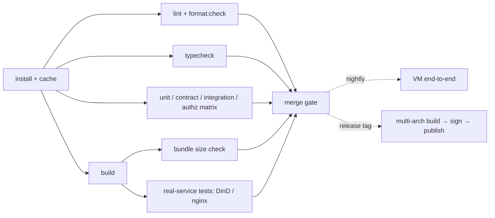

# 10 · Testing Strategy and Quality Gates

> Status: Draft

## 1. Current validation

The checked-in CI runs a frozen pnpm install, lint (including SPDX, dependency licenses and formatting), all workspace type checks, and Vitest on Node.js 24. The release workflow builds the web UI, packages both Linux architectures, writes SHA-256 checksums and publishes channel manifests and changelog-derived release details. A published package is not proof that the panel was deployed or a production notification arrived.

Current automated coverage includes signed agent handshakes, HTTP/auth flows, enrollment, host collectors, updates, backups, TLS material and activation, the alert state machine, notification provider contracts, delivery retries, guided Telegram setup, routing and reactive node drafts. Network-loss tests cover missed WebSocket pongs, unanswered reads and replacement connections. Backup tests exercise the real Node HTTP adapter, including authenticated uploads larger than 64 KiB and bounded rejection of oversized input. Password-change tests verify session/MFA revocation and concurrent changes.

Before release, run the smallest relevant tests first, then `pnpm lint`, `pnpm typecheck`, `pnpm test`, the web production build, `pnpm audit --prod` and packaging. Use Node.js 24 for the SQLite-backed tests. A failure, an omitted check and a successful check must be reported separately.

Browser smoke checks for the current certificate and notification flows use disposable data, real owner setup, desktop/mobile viewports, and mocked outbound providers. These checks do not establish successful Let's Encrypt issuance or live Telegram/email delivery. A full systemd VM installer matrix, continuous browser E2E suite, generated team authorization matrix, coverage threshold, Linux fleet memory/CPU gate and long-running stability job are **not implemented**. The sections below describe the intended v1 test strategy.

### Reproducing the history retention benchmark

Run `node --import tsx scripts/bench-history.mjs` on Node.js 24. It seeds an isolated in-memory SQLite database with 100 nodes × 7 days of minute history, calls the production `createHistory().record()` path for multiple 100-node rounds, and reports timing and the retention query plan. Use `--nodes`, `--days` and `--rounds` to change the bounded fixture. This isolates history-write/cleanup cost; it is not a whole-panel RSS or CPU benchmark. The `metrics_1m_time` index and at-most-once-per-minute pruning prevent each sample from scanning every node's retained history. Retention-setting changes trigger pruning immediately on the next sample.

## 2. Planned v1 test pyramid

| Layer | Tooling | Scope | When |
|---|---|---|---|
| Unit | Vitest | Pure functions: metric math, downsampling, alert state machine, canonicalJSON, permission checks, Nginx template rendering, cron expressions | Every commit |
| Protocol contract | Vitest + test vectors | Frame encode/decode, signature message construction, method schemas; every `packages/protocol/test-vectors/*.json` must pass | Every commit |
| Agent modules | Vitest + fakes | Each module's handlers; external dependencies (`execFile`, filesystem, dockerode) injected as fakes through interfaces | Every commit |
| Panel integration | Vitest | In-process panel (in-memory SQLite) + in-process fake agent (real protocol, fake modules); covers HTTP → Hub → Agent end to end | Every commit |
| Authorization matrix | Vitest (generated) | Route registry × built-in roles × scopes × user mode (`single`, `team`); asserts allow/deny matches expectations. Also asserts that switching team → single leaves no active session or token of any other user | Every commit |
| Frontend components | Vitest + `@vue/test-utils` | Key components: `LogViewer`, `VitalTile`, `SudoDialog`, form validation | Every commit |
| Real services | Vitest + Docker containers | Docker module against a real dockerd (DinD); Nginx templates checked with `nginx -t` in an `nginx:stable` container | Every commit (when CI has Docker) |
| End-to-end | Playwright + VMs | Run the installer in a full-systemd VM (Incus/Multipass/Vagrant): first-run setup, login, enrolling a second node, Docker actions, Nginx apply and rollback, certificates (Pebble), alerts (fake Telegram server) | Nightly + before release |
| Load | `tools/node-sim` | Simulate N agents (real handshake, metrics and events at real rates); measure panel RSS, CPU, event-loop delay | Weekly + before release |
| Resource budgets | Scripts + VM | Agent idle RSS/CPU, initial bundle size, etc. (see [design/00](./00-overview.md) §5) | Before release; over budget blocks the release |

## 3. Testability conventions

- **All external dependencies go through interfaces.** Agent modules do not `import { execFile }` directly; they depend on `Exec`, `Fs`, `Clock`, `DockerClient`, etc. Production injects real implementations, tests inject fakes.
- **Controllable time.** The alert engine, session expiry, TOTP, and similar code depend on a `Clock` interface; tests use a fake clock that can be advanced.
- **`/proc` parsers are pure functions** (text in, structure out). Fixtures live in `apps/agent/test/fixtures/proc/<distro>/`, collected from real machines, including OpenVZ, LXC, and other unusual environments.
- **Recorded command output.** Real output of `nginx -t`, `systemctl show`, `ufw status`, `nft -j list ruleset`, `pm2 jlist`, and `docker compose ls --format json` is stored as fixtures, labeled with the source version.

## 4. Planned additional tests

| Area | Approach |
|---|---|
| Protocol robustness | Fuzz the frame parser with fast-check: random bytes, oversized fields, invalid UTF-8, bad channel numbers; assert no crash and no leaks |
| Backpressure | Fake agent emits logs at 100 MB/s while the browser does not consume; assert panel RSS grows < 20 MB |
| Disconnects | Cut the connection mid-way through metric delivery; assert data is backfilled after reconnect without duplicates |
| ACME | Let's Encrypt's [Pebble](https://github.com/letsencrypt/pebble) test CA with `pebble-challtestsrv`, covering HTTP-01 and DNS-01 |
| WebAuthn | Playwright with a virtual authenticator (CDP `WebAuthn.addVirtualAuthenticator`) for registration, login, and sudo |
| TOTP | RFC 6238 appendix test vectors + window boundaries + replay |
| Firewall rollback | In a VM, apply "deny all inbound" without confirming; assert SSH works again after 60 s |
| Upgrade rollback | In a VM, install a "bad version" that crashes on start; assert automatic rollback |

## 5. Planned v1 CI pipeline

Target merge gate: all checks pass; coverage does not drop below the baseline (core packages `protocol`, `auth`, `alerts` ≥ 85%, others not enforced). This coverage gate is not active yet. Any change to the protocol package must update the test vectors and [design/02](./02-agent-protocol.md) together.

## 6. v1 release-readiness checklist (pending)

- [ ] Fresh install on Debian 12, Ubuntu 24.04, and Rocky 9
- [ ] Upgrade from the previous stable release (panel + 2 agents)
- [ ] Core flows in dark/light themes, English/Chinese, desktop/mobile
- [ ] Panel + local agent run stably for 24 hours on a 512 MB VPS
- [ ] Every item in [kb/security-checklist.md](../kb/security-checklist.md) confirmed
