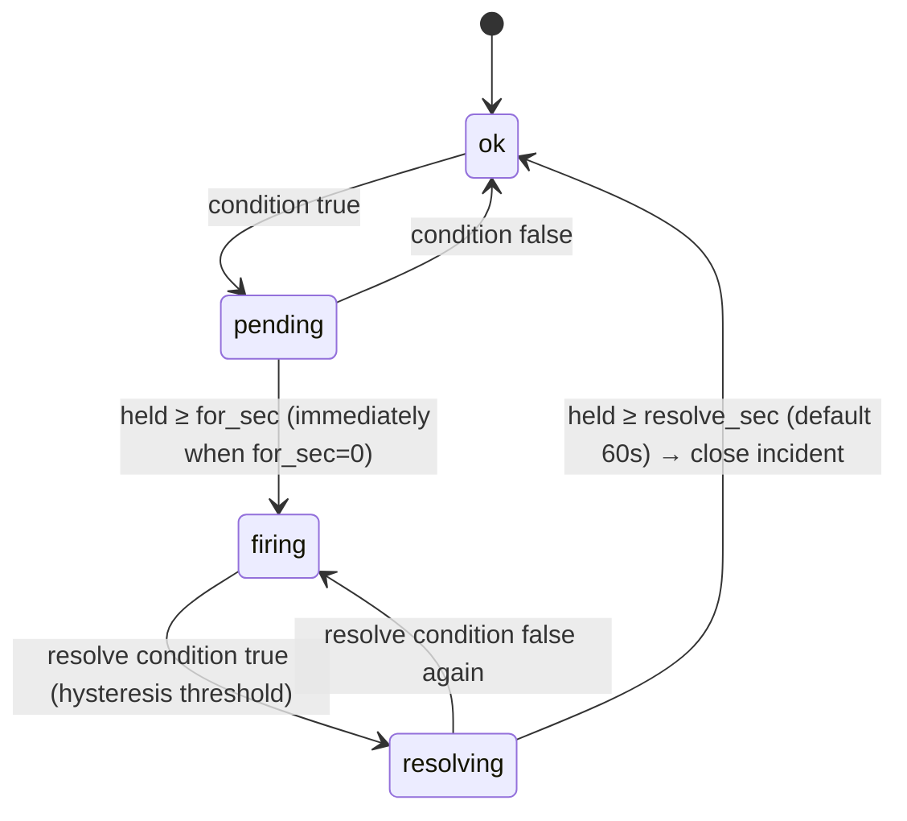

# Module · Anomaly Detection and Alerting

> Status: Draft · Panel component: `alerts/` · Delivery: [notifications.md](./notifications.md)

## 1. Concepts

| Concept | Meaning |
|---|---|
| Rule | What counts as an anomaly: kind, condition, duration, scope, severity, channels |
| Series | One instance of a rule on a "node + target", e.g. "disk > 90%" on `hk-01`'s `/data` |
| Incident | Created when a series enters firing, closed when it resolves; persisted |
| Silence | Suppresses notifications for matching series for a period (incidents are still recorded) |
| Maintenance | Node-level silence; the node's rules are not evaluated at all |

## 2. Rule kinds and conditions

```ts
type RuleCondition =
  | { kind: "metric"; metric: MetricKey; op: ">" | "<"; threshold: number;
      resolveThreshold?: number;        // hysteresis; defaults to threshold ∓ 5%
      mount?: string;                   // disk_pct only: a mount, or "*" for one series per mount
      iface?: string }
  | { kind: "event"; source: "docker" | "pm2" | "service" | "ssh";
      match: EventMatch;                // see §2.2
      countInWindow?: { count: number; windowSec: number };   // e.g. ≥ 3 restarts in 10 minutes
      autoResolveSec: number }          // event alerts auto-resolve after this long without new events
  | { kind: "node_offline"; graceSec: number }
  | { kind: "cert_expiry"; daysBefore: number[] }               // e.g. [14, 7, 3, 1]
  | { kind: "probe"; probeId: string; consecutiveFailures: number }
  | { kind: "traffic_quota"; pct: number[] }
  | { kind: "disk_forecast"; days: number }
  | { kind: "clock_skew"; maxSec: number }
  | { kind: "agent_outdated" };

type MetricKey = "cpu" | "iowait" | "steal" | "mem_pct" | "swap_pct" | "disk_pct" | "inode_pct"
               | "load1_per_core" | "net_rx_bps" | "net_tx_bps" | "tcp_conn";
```

### 2.1 Metric rules

Evaluated every time a node's `metrics.fast` (10 s) arrives; `disk_pct` and `inode_pct` use the latest mount data.

### 2.2 Event matching

```ts
type EventMatch =
  | { source: "docker"; actions: ("die" | "oom" | "health_status:unhealthy" | "restart")[];
      container?: string /* glob */; ignoreExitCodes?: number[] /* default [0, 143] */ }
  | { source: "pm2"; events: ("exit" | "restart" | "errored")[]; name?: string }
  | { source: "service"; units: string[]; states: ("failed" | "inactive")[] }
  | { source: "ssh"; result: "success" | "failure"; user?: string; newIpOnly?: boolean };
```

`docker die` carries the exit code. A manual `docker stop` (exit 143/137 together with a `kill` event) must not alert. The agent adds `expected: true` when the stop was initiated by the panel, or when a `kill`/`stop` event occurred within 10 s before `die`.

## 3. Evaluation and state machine

Each series keeps its state in memory:



- **Hysteresis**: after `cpu > 90` fires, it resolves only once `cpu < 85` holds for 60 s, preventing repeated notifications around the threshold.
- **Missing data**: while a node is offline its metric series are frozen in their current state — no new firing, no resolution. The `node_offline` rule covers the notification. Evaluation resumes when the node returns.
- **Restarts**: after a panel restart, open incidents are loaded from the database and their series start in firing. Pending state is lost, which is acceptable.
- **Cost**: O(rules) comparisons per node every 10 s; 100 nodes × 20 rules is trivial.

## 4. Node offline detection

- A node becomes `offline` when its connection drops or the heartbeat times out (see [design/03](../design/03-node-lifecycle.md)).
- `node_offline` fires after the node has been offline for `graceSec` (default 120 s) and resolves as soon as it reconnects (no `resolve_sec` wait).
- **Offline rules are not evaluated during the first 3 minutes after the panel starts**: agents need time to reconnect, otherwise every panel restart would page for every node.
- **Mass outage**: if more than 50% of nodes go offline at once, the panel's own network is the likely cause. The panel sends one combined notification ("Many nodes offline — possible panel network issue") instead of one per node.

## 5. Notification policy

| When | Behavior |
|---|---|
| Enters firing | Send to the rule's channels whose `min_severity` ≤ the rule severity |
| Still firing | Remind every `repeat_sec` (default: critical 1 hour, warning never); acknowledged incidents stop reminding |
| Resolved | If `notify_resolved = true`, send a resolution notice with the duration |
| Silenced / maintenance | Nothing sent; the incident is still recorded and marked `silenced` |
| Grouping | When a channel has more than 5 pending notifications within 30 s, they are combined into one digest |

## 6. Built-in rules (created at first-run setup; editable or disableable)

| Rule | Condition | Severity |
|---|---|---|
| Node offline | `node_offline`, 120 s grace | critical |
| Low disk space | `disk_pct > 90`, per mount, for 5 minutes | warning |
| Disk almost full | `disk_pct > 97`, for 1 minute | critical |
| Low inodes | `inode_pct > 90` | warning |
| Memory pressure | `mem_pct > 95`, for 5 minutes | warning |
| Sustained CPU saturation | `cpu > 95`, for 10 minutes | warning |
| High CPU steal | `steal > 20`, for 10 minutes (sign of VPS oversubscription) | info |
| Container crashed / OOM | `docker die/oom`, ignoring normal exits | warning |
| Container restart loop | `docker restart` ≥ 3 times in 10 minutes | critical |
| PM2 process failing | `pm2 errored`, or ≥ 5 restarts in 10 minutes | warning |
| Service failed | A watched unit enters `failed` | critical |
| Certificate expiring | 14 / 7 / 3 / 1 days left | warning (critical at ≤ 3 days) |
| Traffic quota | 80% / 90% / 100% | warning |
| Disk-full forecast | Projected full within 3 days | warning |
| Clock skew | > 30 s | warning |
| Successful SSH login | Login from a new IP (disabled by default) | info |

## 7. Monitoring the panel itself (who watches the watcher)

If the panel is down, nobody sends alerts. Two mechanisms are provided, and the settings page nudges users to enable at least one:

1. **External heartbeat (recommended)**: configure a heartbeat URL (e.g. healthchecks.io, or an Uptime Kuma push monitor). The panel sends a GET every minute with `?status=<0|1>&nodes_offline=<n>` appended. The external service notifies the user when heartbeats stop.
2. **Watcher node (optional)**: designate a remote node as a watcher. Over the authenticated connection, the panel gives that node's agent a **send-only** Telegram configuration (bot token + one chat_id), stored encrypted on the node. If the agent cannot reach the panel for 5 consecutive minutes, it sends "Panel unreachable" directly via Telegram. This means the bot token also lives on that node, and the UI says so clearly when enabling it.

## 8. UI

- **Active alerts**: sorted by severity and start time; acknowledge, silence (quick options: 1 hour / 4 hours / 1 day / custom), jump to node or resource.
- **History**: filterable timeline with durations.
- **Rules**: list + form editor. A "Preview" button replays a metric rule over the last 24 hours and shows how many times it would have fired.
- **Silences**: list with time remaining.
