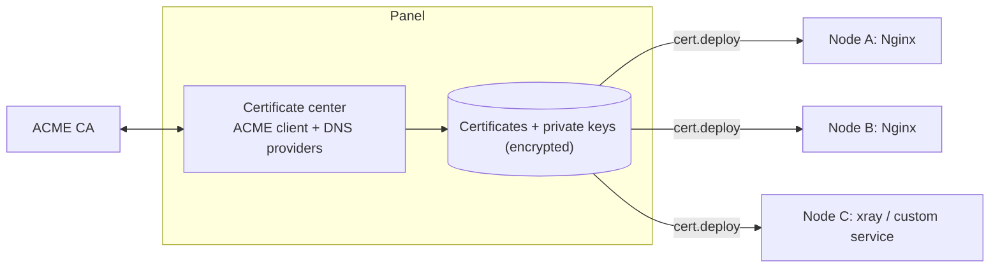

# Module · Certificate Management

> Status: Draft · Panel component: `acme/` · Agent module: `cert` · External details: [kb/acme-letsencrypt.md](../kb/acme-letsencrypt.md)

**Available from alpha.19:** the panel's Certificates page supports self-signed generation, PEM import, and Let's Encrypt production/staging issuance for one domain through HTTP-01 on the local root agent. Certificate material and account keys are encrypted in SQLite. Applying a certificate enables native HTTPS/WSS on the existing panel port after local fingerprint and health verification. ACME renewal uses the certificate's actual lifetime with retry backoff and preserves the active certificate on failure. New direct-access installs default to self-signed HTTPS. See [the access runbook](../kb/panel-https.md).

The sections below describe the broader design. DNS-01, wildcards, other CAs, external monitoring, ARI, certificate deployment to remote services, and renewal hooks are not implemented yet. The current code is in `apps/panel/src/tls/` and `apps/agent/src/cert.ts`; HTTP-01 uses a temporary listener only and does not rewrite Nginx configuration.

Manual renewal preserves the certificate's automatic-renewal setting. Choosing Renew now does not silently re-enable a schedule the user disabled. Failed issuance or activation continues to leave the previous active certificate in service.

The ACME dependency is pinned to 5.4.0 with a one-line pnpm patch removing its unused, deprecated `forge` export. A matching scoped override removes `node-forge` from the dependency tree because all issuance and CSR operations use the client's native crypto API. This avoids introducing [GHSA-86w9-cpqp-85rv](https://github.com/advisories/GHSA-86w9-cpqp-85rv), for which no patched forge version was available when verified on 2026-10-03. Keep the patch and override together when upgrading the client, and rerun issuance tests, bundle validation, and the production audit.

## 1. Core idea: issue centrally, deploy anywhere



- A certificate (e.g. `*.example.com`) is issued once, deployed to any number of nodes, and redeployed automatically after renewal.
- Private keys are generated on the panel, stored encrypted, and sent over the authenticated agent connection. The trade-off: deploying one certificate to several nodes requires sharing one private key, and the agent connection is already protected by TLS and mutual authentication.

## 2. Certificate sources

| Source | Meaning |
|---|---|
| `acme` | Issued and renewed automatically by the panel |
| `uploaded` | PEM pasted or uploaded by the user (chain + key). Parsed with `crypto.X509Certificate`; checks the key matches the certificate and the chain order is correct; expiry reminders |
| `external_watch` | Expiry monitoring only, no private key. Target is `host:port` (optional SNI); the panel or a chosen node opens a TLS connection and reads the peer certificate |

## 3. ACME

### 3.1 Accounts

- Supported CAs: Let's Encrypt (production / staging), ZeroSSL (EAB required), Google Trust Services (EAB required), custom directory URL.
- One account per directory; account keys stored encrypted.
- Library: `acme-client`.

### 3.2 Challenge types

| Type | When | Implementation |
|---|---|---|
| DNS-01 | Wildcards, internal hosts, port 80 unavailable | The panel adds a TXT record via the DNS provider API → **queries the authoritative DNS directly** to confirm → asks the CA to validate → removes the record |
| HTTP-01 | Domain resolves to a node with port 80 reachable | The panel calls `cert.http01.put {token, keyAuth}` on the target node, which serves the file via an Nginx snippet or a temporary listener |
| Manual DNS-01 | DNS provider without an API | The UI shows the TXT record to add; the user clicks "Continue" once added (no automatic renewal; expiry reminders instead) |

**DNS providers** (plugin interface `DnsProvider { createTxt(fqdn, value); removeTxt(fqdn, value) }`):

- v1: Cloudflare (API token with `Zone.DNS:Edit`), Alibaba Cloud DNS, Tencent Cloud DNSPod;
- P2: Huawei Cloud, AWS Route 53, GoDaddy, Namecheap, acme-dns, RFC 2136.

**DNS-01 details**:

- If `_acme-challenge.<domain>` has a CNAME, follow it and create the record in the target zone (validation delegation).
- Propagation check: resolve the zone's authoritative NS, then query TXT directly with `dns.promises.Resolver` + `setServers(<authoritative NS IPs>)`, every 5 s for up to 180 s. Public recursive resolvers are not used, to avoid false results from caching.
- Records for all domains in an order are added in parallel and checked together.

**HTTP-01 details** (on the target node):

1. Nginx present and the domain already has a managed site: the site already includes the `acme.conf` snippet, so the agent just writes `/var/lib/unpanel-agent/acme/.well-known/acme-challenge/<token>`;
2. Nginx present but no site for the domain yet: the agent temporarily writes `conf.d/unpanel-acme-<slug>.conf` (port 80 only, `server_name` set to the domain, serving only the challenge path), tests and reloads, and removes it afterwards;
3. No Nginx and port 80 free: the agent temporarily starts a minimal HTTP server on port 80 that answers only the challenge path, and closes it immediately afterwards;
4. Port 80 taken by something else (Caddy, a Docker container, …): return a clear error and guide the user to DNS-01.

### 3.3 Issuance parameters

- Key type: `ec-p256` (default), `ec-p384`, `rsa-2048`, `rsa-4096`;
- A new private key is generated on renewal by default (reusing the old key is possible for pinning scenarios, rarely needed);
- Optional ACME profile (e.g. Let's Encrypt's `shortlived`), depending on CA support.

### 3.4 Issuance runs as a job

Issuance is a job (`dedupeKey = cert.issue:<certId>`) with a live log: create order → per-domain validation progress → finalize → download certificate → store → trigger deployments.

## 4. Renewal

- Once a day, at a random time (to avoid hitting the CA at the same moment as everyone else), all `auto_renew` certificates are checked.
- A certificate is renewed when either holds:
  - the CA supports ARI (ACME Renewal Information) and the current time is inside the suggested renewal window;
  - without ARI, less than 1/3 of the total lifetime remains (a 90-day certificate renews at about 30 days left; shorter lifetimes adapt automatically).
- Failures retry with 1 h → 6 h → 24 h backoff; each failure sends a notification with the CA's error message. With ≤ 7 days left, severity escalates to critical.
- Let's Encrypt stopped sending expiration emails in 2025, so the panel's own expiry monitoring (the `cert_expiry` rule in [alerting.md](./alerting.md)) is essential.

## 5. Deployment

```ts
interface CertDeployment {
  nodeId: string;
  targetDir: string;          // default /etc/unpanel-agent/certs/<certName>
  files?: {                   // custom file names for different software
    fullchain?: string;       // default fullchain.pem
    cert?: string;            // cert.pem
    chain?: string;           // chain.pem
    key?: string;             // privkey.pem
  };
  owner?: string;             // default root; some services read certificates as a non-root user
  reload: ReloadAction[];
}
type ReloadAction =
  | { kind: "nginx" }                                  // test, then reload
  | { kind: "service"; unit: string; action: "reload" | "restart" }
  | { kind: "docker"; container: string; action: "restart" | "kill-hup" }
  | { kind: "hook" };                                  // run the node-local /etc/unpanel-agent/hooks/cert-<certName>.sh
```

- The agent's `cert.deploy`: atomic writes (key 0600, certificates 0644, directory 0750) → run reload actions in order → return results and the serial number.
- **There is no "run a custom command" reload action.** When something custom is truly needed, place a hook script on the node. That path is in the default policy's `deny_paths`, so the panel cannot write it; only the node's administrator can install hooks. This keeps the "no generic remote exec" principle.
- Deployment jobs for offline nodes enter `waiting_node` and run automatically when the node returns.
- The panel's own certificate: the special target `panel-self`, written by the local agent to `/var/lib/unpanel/tls/` with owner `unpanel`. The panel notices the change and hot-reloads via `server.setSecureContext()` without restarting.

## 6. Methods (agent side)

| Method | Risk | Notes |
|---|---|---|
| `cert.http01.put` / `cert.http01.remove` | write | Place / remove challenge files, creating a temporary site or listener when needed |
| `cert.deploy` | danger | Deploy certificate files and run reload actions |
| `cert.remove` | danger | Remove deployed files |
| `cert.inspect` | read | Serial and expiry of certificates deployed on the node (for reconciliation) |
| `cert.tlsProbe` | read | Connect to `host:port` from this node and read the peer certificate (for `external_watch`) |

## 7. UI

- **Certificate list**: domains, source, issuer, expiry (with a days-left color bar), auto-renew state, deployment count and status.
- **Expiry timeline**: all certificates ordered by expiry.
- **Issuance wizard**: domains → challenge type (recommended based on wildcards and available nodes) → CA → key type → deployment targets (multiple nodes, reload actions).
- **Details**: chain, SANs, fingerprints, issuance/renewal history (job logs), deployment state, plus "Renew now", "Redeploy", and "Download" (downloading the private key requires sudo).
