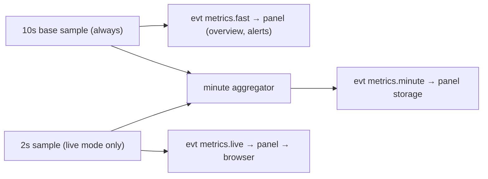

# Module · Load Monitoring and Traffic Accounting

> Status: Draft · Agent modules: `metrics`, `system` · Formulas: [kb/linux-metrics.md](../kb/linux-metrics.md)

## 1. Goals

- A 3x-ui-style live dashboard refreshing every 2 seconds;
- History charts: 1 hour, 24 hours, 7 days, 30 days, 1 year;
- Multi-node overview refreshing every 10 seconds;
- Monthly traffic accounting with quotas and alerts;
- Very low idle overhead (see [design/00](../design/00-overview.md) §5).

## 2. What is collected

| Metric | Source | Live | Per-minute aggregate |
|---|---|---|---|
| Total CPU, user/system/iowait/steal | `/proc/stat` deltas | ✓ | avg, max |
| Per-core CPU | `/proc/stat` | ✓ (live mode) | — |
| Load 1/5/15 | `/proc/loadavg` | ✓ | last |
| Memory total/available/used, buffers/cached | `/proc/meminfo` | ✓ | avg |
| Swap total/used | `/proc/meminfo` | ✓ | avg |
| Capacity/used/inodes per mount | `/proc/self/mountinfo` (filtered) + `fs.statfs` | ✓ (refreshed every 30 s) | last |
| Disk IO bytes/s, IOPS | `/proc/diskstats` deltas (whole disks only) | ✓ | avg, max |
| NIC bytes/s, packets/s, errors | `/proc/net/dev` deltas | ✓ | avg, max |
| TCP/UDP sockets | `/proc/net/sockstat`, `sockstat6` | ✓ | last |
| Process count | `/proc/loadavg` field 4 | ✓ | last |
| Uptime | `/proc/uptime` | ✓ | — |
| Temperatures (optional) | `/sys/class/hwmon/*/temp*_input` | ✓ | max |

Mount filtering: keep only `ext2/3/4`, `xfs`, `btrfs`, `zfs`, `f2fs`, `vfat`, `exfat`, `ntfs3`, `nfs*`, `cifs`, `fuse.*` (configurable); exclude `tmpfs`, `overlay`, `squashfs`, `devtmpfs`, `proc`, and similar. Repeated mounts of the same device (e.g. Docker bind mounts) count once.

No `systeminformation` or similar libraries: they spawn child processes frequently and are expensive. Everything is read from `/proc` and `/sys` with `fs.readFile`, reusing buffers.

### On-demand data (not collected continuously)

| Method | Content | Implementation |
|---|---|---|
| `system.processes` | Top N processes (CPU, memory, user, command) | Scan `/proc/[pid]/stat`, `statm`, `status`; two samples 1 s apart for CPU% |
| `system.ports` | Listening ports and owning processes | Parse `ss -tulpnH` |
| `system.info` | Host information (`HostInfo`) | Collected at startup, refreshed on demand |
| `system.logins` | Recent logins | `last -F -n 50` or journald |

## 3. Sampling cadence



- The base sample is always every 10 s. In live mode sampling switches to 2 s, and the 10 s `metrics.fast` is synthesized from the latest 2 s samples.
- CPU usage is the average between two samples, so the "minute max" is the highest 10 s (or 2 s) average within that minute, not an instantaneous peak. The UI tooltip says so.
- Mount capacity is read every 30 s (`statfs` is cheap, but there is no reason to read more often).

## 4. Payloads

```ts
interface MetricsFast {             // ≈ 200 bytes
  cpu: number;                      // 0–100
  load1: number;
  memUsed: number; memTotal: number;
  swapUsed: number; swapTotal: number;
  diskMaxPct: number; diskMaxMount: string;
  rxBps: number; txBps: number;
  tcp: number;
  uptime: number;
}

interface MetricsLive extends MetricsFast {
  cpuDetail: { user: number; system: number; iowait: number; steal: number; irq: number };
  perCore: number[];
  load5: number; load15: number;
  memDetail: { buffers: number; cached: number; available: number };
  mounts: { mount: string; fs: string; total: number; used: number; inodesPct: number }[];
  disks: { name: string; rBps: number; wBps: number; rIops: number; wIops: number }[];
  ifaces: { name: string; rxBps: number; txBps: number; rxPps: number; txPps: number }[];
  udp: number; procs: number;
  temps?: { label: string; c: number }[];
}

interface MetricsMinute {           // stored in metrics_1m
  ts: number;                       // start of the minute
  cpuAvg: number; cpuMax: number; iowait: number; steal: number;
  load1: number; load5: number; load15: number;
  memUsed: number; memTotal: number; swapUsed: number; swapTotal: number;
  diskUsedMaxPct: number; diskReadBps: number; diskWriteBps: number;
  netRxBps: number; netTxBps: number; netRxBpsMax: number; netTxBpsMax: number;
  tcp: number; udp: number; procs: number;
  extra: { mounts: Record<string, { used: number; total: number }>; ifaces: Record<string, { rx: number; tx: number }> };
}
```

Network throughput counts the **metered interfaces** by default (see §6), excluding `lo`, `docker0`, `br-*`, `veth*`, `virbr*`, and `tun*`/`wg*` (tunnels can be opted in).

## 5. Storage and queries

- On `metrics.minute`, the panel writes to `metrics_1m` with `INSERT OR REPLACE` keyed by `(node_id, ts)`, so buffer replays are safe.
- Writes are batched: once per second, all nodes' pending minute rows are written in a single transaction.
- Downsampling runs at minute 5 of every hour: the previous complete hour of `metrics_1m` is aggregated into `metrics_1h` (averages averaged, maxima maxed, last values taken last).
- The latest `MetricsFast` of each node is kept in memory for the overview and alerting; no database reads.

Query `GET /nodes/:id/metrics?from&to`:

| Range | Source | Points returned |
|---|---|---|
| ≤ 48 hours | `metrics_1m` | Re-bucketed when over 720 points |
| > 48 hours | `metrics_1h` | Re-bucketed when over 720 points |

Gaps (node offline) are returned as `null`, and charts show a break instead of a straight line.

## 6. Monthly traffic

VPS plans are usually billed by monthly traffic, and 3x-ui users care about this a lot.

### 6.1 Node configuration (`nodes.traffic_json`)

```ts
interface TrafficConfig {
  resetDay: number | "last";       // 1–28, or the last day of the month
  quotaBytes?: number;              // omitted = no quota
  mode: "sum" | "max" | "tx" | "rx"; // billing: both directions / larger direction / outbound only / inbound only
  ifaces: "auto" | string[];        // auto: all physical NICs (/sys/class/net/<if>/device exists) + venet0 (OpenVZ)
  alertAtPct: number[];             // default [80, 90, 100]
}
```

### 6.2 Counter handling (agent side)

Kernel interface counters reset on reboot and can wrap on 32-bit systems. The agent keeps `{lastRaw, pendingRx, pendingTx, seq}` per interface in `state.json`:

```
delta = raw >= lastRaw ? raw - lastRaw : raw   // a decrease means reset or wrap; count only the new value
```

Every minute it sends `traffic.counters {seq, ifaces: {name: {rx, tx}}}` (deltas for the period). The panel stores the last processed `seq` per node and drops duplicates. Deltas are added to `traffic_daily` in the **node's time zone**.

### 6.3 Presentation

- Node dashboard: used/quota progress for the current billing period, plus the projected usage at period end (linear extrapolation from the daily average).
- Traffic page: daily bars for the current period (in/out stacked), monthly bars for the last 12 periods, per-interface breakdown.
- Alerts: one notification per threshold in `alertAtPct` per period.

## 7. Disk-full forecast

Every hour, a linear regression runs over the last 7 days of `metrics_1h` used space per mount. An alert fires when the slope is positive, R² ≥ 0.6, and the projected time to full is under `disk_forecast.days` (default 3 days). No forecast with less than 24 hours of data.

## 8. UI

- **Node dashboard**: four `StatRing`s (CPU, memory, swap, fullest disk); system info card; throughput and current-period traffic card; TCP/UDP connections card; live charts (CPU, memory, network, disk IO) with range switching; "Processes" and "Ports" tabs loaded on demand.
- **Overview**: node cards (`PulseRail` + three mini rings + throughput) or a table view sortable by any metric.
- **Compare**: pick several nodes and overlay one metric on a single chart.
